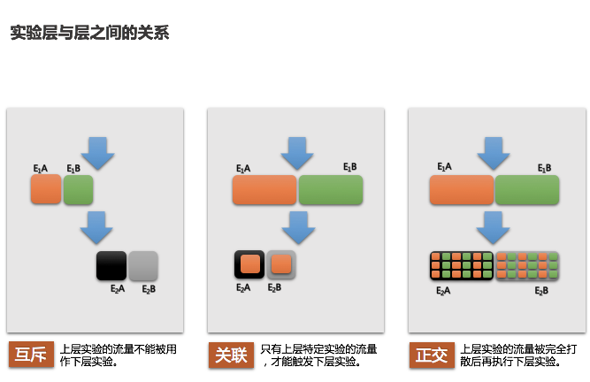

# AB实验原理介绍
## 1 AB实验简介
### 1.1 什么是AB实验？
在互联网领域的实验，俗称A/B测试，并不是个新兴的概念，所谓AB实验，是指单个变量具有两个版本A和B的随机实验。在实际应用中，是一种比较单个（或多个）变量多个版本的方法，通常是通过测试受试者对多个版本的反应，并确定多个版本中的哪个更有效。Google工程师在2000年进行了首次AB实验，试图确定在其搜索引擎结果页上显示的最佳结果数。到了2011年，Google进行了7,000多次不同的AB实验。现在很多公司使用“设计实验”的方法来制定营销决策，期望在实验样本上可以得到积极的转化结果，并且随着工具和专业知识在实验领域的发展，AB实验已成为越来越普遍的一种做法。   

### 1.2 AB实验流程
一个完整的AB实验流程是通过不断的进行“指标数据分析->定位问题->提出改进方案->AB测试”来优化产品策略，减少每个环节的损耗、提高转化率，而AB实验是这整个过程中的重要一环，也是分析解决问题过程中最重要的武器。  
如下图所示，AB 实验可以看作一个“无尽”的学习环，我们通过“指标数据分析->发现问题->建立假设（提出改进方案）->AB实验->验证假设”，若假设不成立则继续分析数据提出新方案进行试验，若假设成立则上线新方案，这就形成一个完整的闭环，通过多轮实验迭代，使策略趋于更优。通过上面的分析，可以发现AB实验已经成为数据驱动产品的必要工具。建立一个强大易用的AB实验平台，可以提升AB实验的效率，保证产品在正确的方向上快速迭代。  

## 2 AB实验模型
实验模型是AB实验平台搭建的根基，底层的实验模型直接影响了平台AB实验的能力。因此我们在了解AB实验的背景之后，先介绍两种最常见的实验模型。  
### 2.1 经典实验模型
经典实验模型的AB测试，简单来说就是为同一个目标制定两个方案，让一部分用户使用A方案，另一部分用户使用B方案，记录和分析用户的使用情况，看哪个方案更符合设计。在自然科学领域，区分A方案为现行的设计（称为控制组）， B方案是新的设计（称为实验组）。比较这两个版本之间你所关心的数据（转化率，业绩，跳出率等），最后选择效果最好的版本。  
如果使用的场景只有一个目标，并为此设计了多套解决方案，使用经典的AB实验模型可以很好的决策哪套方案更优。但在我们的真实环境，情况要复杂的多。一次的用户请求请求往往要经过多个服务的处理。以外卖首页门店列表的场景为例，服务化的工程包括：API服务 -> Rank服务，其中Rank服务又包括：LBS服务 -> 粗排序服务（基础分）-> 重排序服务（推荐）。如果需要在多个服务中进行AB测试，就会形成多层的AB测试。如果要求每个请求最多只进入一个实验，那么就有可能存在流量饥饿问题（上游服务的实验可能优先处理了所有请求，导致下游服务的实验没有请求），和偏置的问题（上游服务的实验处理了所有北京用户的请求，导致下游服务的实验就只有非北京用户的请求）。  

### 2.2 Google重叠实验模型
为了解决这些问题，Google于2010年提出了重叠实验框架（Overlapping Experiment infrastructure），它在尽量保留单层实验框架的优点（易用，快速）的同时，增加了可扩展性，灵活性，和健壮性。同时还实现了一种可控的，定义明确的逐步放量的方式。  
重叠实验模型用到了科学研究中设计实验的一个核心的思想：控制变量法。即把多因素的问题变成多个单因素的问题，而只改变其中的某一个因素，从而研究这个因素对事物影响。重叠实验框架的核心思路就是，将一套综合的方案（如，首页排序方案）拆解成更小的能对效果产生影响的因素（如，活动分的权重，计算销量的算法，广告的位置，推荐的模型）。将验证一个因素的一系列实验关联到同一层中（实验层），每个请求会经过多个实验层，同一层只会被一个实验处理。每个实验考察自己层相关联的因素，并且同一因素不能出现在多个层中。  
Google《Overlapping Experiment Infrastructure: More, Better, Faster Experimentation》论文地址：https://static.googleusercontent.com/media/research.google.com/en//pubs/archive/36500.pdf   
#### 2.2.1 域、层、实验
（1）域 是指流量的一个划分（一部分流量的意思）。  
（2）层 是指系统参数的一个子集。  
（3）实验 是指在一个流量划分上，进行零个或多个参数的修改，并最后改变请求处理的过程。   

### 2.2.2 层与层的关系 
在多层实验模型中，首先需要明确的就是实验层与层之间的关系。层与层之间存在三种关系：互斥、关联、正交（图2-2）。  
（1）互斥：上层实验的流量不能被用作下层实验。通过实验层的互斥，可以解决两个实验干扰的问题。  
（2）关联：只有上层特定实验的流量，才能触发下层实验。通过实验层的关联，可以解决两个实验有依赖关系的问题。  
（3）正交：上层实验的流量被完全打散后再执行下层实验。通过实验层的正交，保证了实验层之间的实验互不影响，解决了经典实验模型中流量饥饿和偏置的问题。 
 
### 2.2.3 谷歌层叠实验原理
在谷歌提出的层叠实验原理中，域和层可以相互嵌套，域中包含层，层中包含实验，层中也可以包含域。在一个层中嵌套域可以使这一层中的参数在嵌套域中进行进一步划分。开始时，我们有默认的域和层，它有包含所有的流量和参数，在默认域和层中，比如我们可以：  
* 简单地将参数分为三层（图2-4a），这种情况下，每个请求最多只会同时在三个实验中，每层一个，每个实验只能修改相应层的参数。  
* 我们可以先将流量分为两个域，一个域只有一个单一层（非重叠域），和一个有三个层的重叠域（见图2-4b），在这种情况下，每个请求会分到非重叠域或是重叠域。请求只能在非重叠域或重叠域其中之一。如果请求在重叠域，那么请求最多在一个实验中（这个实验可以改变参数集合中的任意参数的值），如果请求在重叠域，那么请求最多在三个实验中，每层一个实验。并且对于每个实验，只能使用对应层的参数。  
 
另一个概念是发布层（Launch layers） ，发布层与前面介绍的实验层有下面区别：  
* 发布层总是在默认域中（比如，它们有全部流量）。
* 发布层是对参数的一个独立划分，比如，一个参数最多只能同时在一个发布层和最多一个正常层中（一个域中）。
* 为了让发布层和正常层的重复参数配合起来。在发布层中的实验有着稍有不同的语法。特别是，在发布层的实验会为覆盖参数的默认值，作为新的默认值，换言之，如果没有正常实验层的实验覆盖了默认参数，那么在发布层的行为就像一个普通的实验，但如果实验层的实验覆盖了默认值，那么实验就会用这个覆盖的值，而不是系统的默认值，或是发布层实验中的参数值。
发布层的示例在图2-4c, d中，通过发布层，我们能以一种标准通用的方式逐步灰度最终全量一个实验策略，且可以跟踪灰度过程中实验效果变化。 通常情况下，每有一个新特性要开始全量时都需要新建一个发布层，当这个新特性最终完成全量时，再将相应的发布层删除。并且因为发布层实验的流量一般都比较大，所以它们可以用于测试特性之间的相互影响，虽然理论上我们可以测试正常实验层的特性相互影响（比如，如果参数在同一层，我们可以手工设置创建实验，如果参数在不同层，我们观察实验的交集流量），但因为在正常层中，实验流量比较少，交集比较小，所以相互影响很难检测。  

### 2.2.4 流量分配方式
实验还需要确定实验所用的流量如何分配。最简单的分配方式是用随机流量，即对每个请求都进行随机分配。但这样做的问题是如果实验是用户可见的改变（比如，首页门店列表顺序），那么一个用户就可能得到不同的用户体验（门店的顺序变来变去），这会造成用户体验不一致。在这里常用的解决方案是用UUID作为流量分配的依据，UUID被用来定位唯一用户。实践中，UUID是与终端相关的，虽然可能被清除，而且也不能唯一定位一个用户，但对于连续的请求，它可以提供给用户一致性的用户体验。对于实验流量分配，我们使用UUID哈希取模进行分配，比如模100，将模[0-49]的流量聚合为实验A的流量，模[50-99]的流量聚合为实验B的流量，理论上在一定的样本量下实验A和B的流量的大小将非常相近。  
除了随机方式和UUID取模方式（表2-1），还有一种流量分配的需求，就是按UUID和日期取模。采用这种方式，一个实验一天内圈定的UUID是固定的，但随着日期的变更会圈定不同的UUID。这种定期打散实验流量的方式，经常被用到红包和优惠券发放等营销业务场景中。  
 
