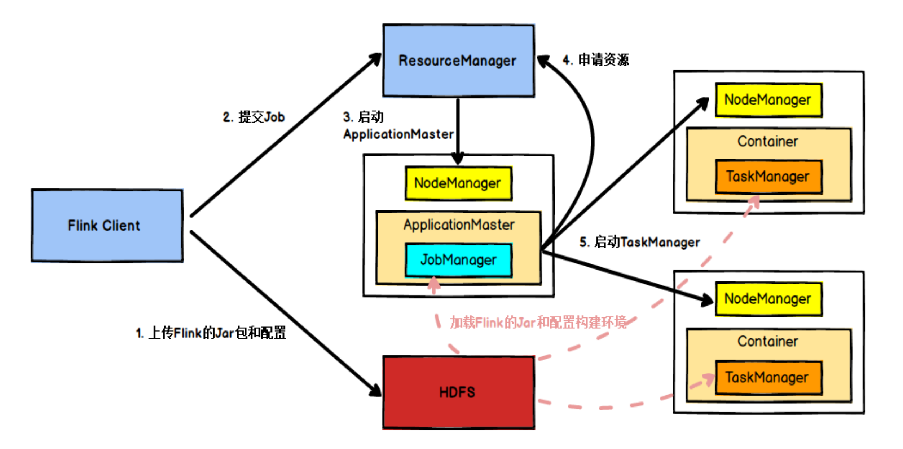
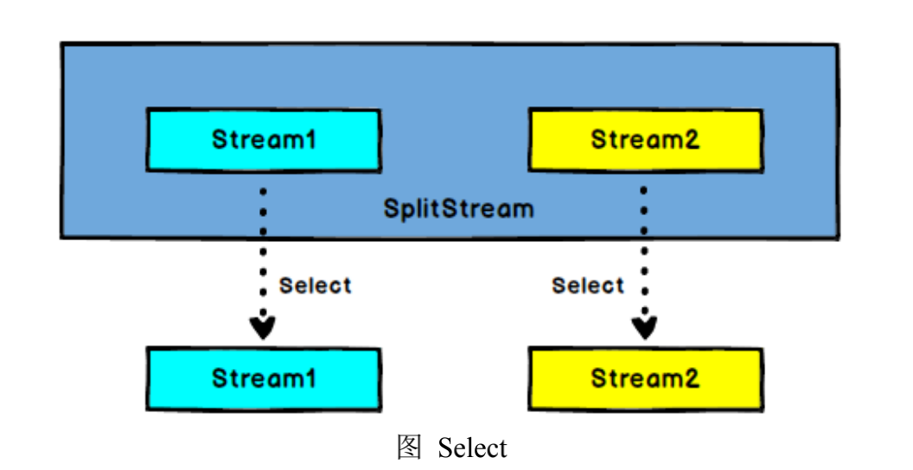
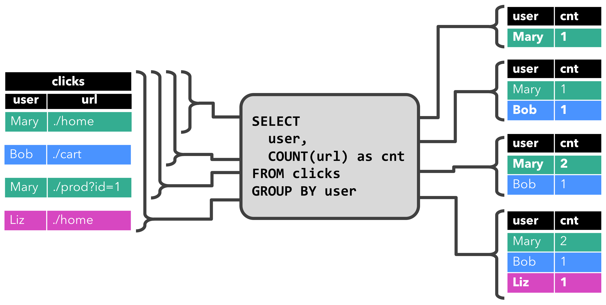

# Flink流处理简介
## 1. Flink简介
### 1.1 Flink是什么？
Apache Flink is a framework and distributed processing engine for stateful computations over unbounded and bounded data streams.

Apache Flink 是一个计算框架和分布式处理引擎，用于对无界和有界数据流进行有状态计算。其针对数据流的分布式计算提供了数据分布、数据通信以及容错机制等功能。基于流执行引擎，Flink 提供了诸多更高抽象层的 API 以便用户编写分布式任务：
1) DataSet API：对静态数据进行批处理操作，将静态数据抽象成分布式的数据集，用户可以方便地使用 Flink 提供的各种操作符对分布式数据集进行处理，支持 Java、Scala 和 Python。
2) DataStream API：对数据流进行流处理操作，将流式的数据抽象成分布式的数据流，用户可以方便地对分布式数据流进行各种操作，支持 Java 和 Scala。
3) Table API：对结构化数据进行查询操作，将结构化数据抽象成关系表，并通过类 SQL 的 DSL 对关系表进行各种查询操作，支持 Java 和 Scala。
此外，Flink 还针对特定的应用领域提供了领域库，例如：
1) Flink ML：Flink 的机器学习库，提供了机器学习 Pipelines API 并实现了多种机器学习算法
2) Gelly：Flink 的图计算库，提供了图计算的相关 API 及多种图计算算法实现
### 1.2 为什么选择Flink？
Flink作为新一代的大数据项目，除了尽量匹配其他大数据项目所提供的能力之外，还拥有一些不错的特性，列举如下：
* 既支持批处理也支持流计算，拥有一个 streaming-first（流优先）的运行时（runtime）引擎；
* 为Java以及Scala开发者提供优雅而流畅的API；
* 可进行大规模扩展同时兼顾高吞吐和低延迟；
* 基于”Dataflow Model“（数据流模型）在DataStream API中支持事件时间、无序处理、事件延迟等能力并保证结果的正确性；
* 灵活且支持多种时间语义（事件时间、处理时间、摄入时间）的窗口；
* 支持状态以及容错性（fault-tolerance）并提供恰好一次（exactly-once）的一致性语义保证；
* 程序更新、扩容后不丢失状态的保存点机制；
* 流计算中自然的反压机制；
* 提供关系及SQL查询、图计算、机器学习以及复杂事件处理等领域特定库；
* 内置对迭代的支持；
* 自实现的具备高效性和鲁棒性的显式内存管理机制；
* 提供对Hadoop以及Storm的兼容性；
* 提供与YARN、HDFS、HBase以及Hadoop生态系统中其他部件的集成能力；

以上这些特性在保证Flink满足通用目的的数据分析与处理的同时也使得其成为某些特殊领域与场景（比如要求极低延迟、较高准确性的实时流计算）的可靠选择。
总结：低延迟、高吞吐、结果的准确性和良好的容错性。
### 1.3 Flink应用场景
* **1.Data Pipeline**

Data Pipeline 的核心场景类似于数据搬运并在搬运的过程中进行部分数据清洗或者处理，而整个业务架构图的左边是Periodic ETL，它提供了流式 ETL 或者实时 ETL，能够订阅消息队列的消息并进行处理，清洗完成后实时写入到下游的Database 或 File system 中。场景举例：
1) 实时数仓: 当下游要构建实时数仓时，上游则可能需要实时的 Stream ETL。这个过程会进行实时清洗或扩展数据，清洗完成后写入到下游的实时数仓的整个链路中，可保证数据查询的时效性，形成实时数据采集、实时数据处理以及下游的实时 Query。
2) 搜索引擎推荐: 搜索引擎这块以淘宝为例，当卖家上线新商品时，后台会实时产生消息流，该消息流经过 Flink 系统时会进行数据的处理、扩展。然后将处理及扩展后的数据生成实时索引，写入到搜索引擎中。这样当淘宝卖家上线新商品时，能在秒级或者分钟级实现搜索引擎的搜索。
* **2.Data Analytics**

Data Analytics，如图，左边是 Batch Analytics，右边是 Streaming Analytics。Batch Analytics 就是传统意义上使用类似于Map Reduce、Hive、Spark Batch 等，对作业进行分析、处理、生成离线报表；Streaming Analytics 使用流式分析引擎如Storm、Flink 实时处理分析数据，应用较多的场景如实时大屏、实时报表。
* **3.Data Driven**

从某种程度上来说，所有的实时的数据处理或者是流式数据处理都是属于 Data Driven，流计算本质上是 Data Driven 计算。应用较多的如风控系统，当风控系统需要处理各种各样复杂的规则时，Data Driven 就会把处理的规则和逻辑写入到Datastream 的 API 或者是 ProcessFunction 的 API 中，然后将逻辑抽象到整个 Flink 引擎，当外面的数据流或者是事件进入就会触发相应的规则，这就是 Data Driven 的原理。在触发某些规则后，Data Driven 会进行处理或者是进行预警，这些预警会发到下游产生业务通知，这是 Data Driven 的应用场景，Data Driven 在应用上更多应用于复杂事件的处理。
### 1.4 Flink基础概念
了解 Flink 应用开发需要先理解 Flink 的 Streams、State、Time 等基础处理语义以及 Flink 兼顾灵活性和方便性的多层次 API。

1、Streams：流，分为有限数据流与无限数据流，unbounded stream 是有始无终的数据流，即无限数据流；而 bounded stream 是限定大小的有始有终的数据集合，即有限数据流，二者的区别在于无限数据流的数据会随时间的推演而持续增

加，计算持续进行且不存在结束的状态，相对的有限数据流数据大小固定，计算最终会完成并处于结束的状态。

2、State，状态是计算过程中的数据信息，在容错恢复和 Checkpoint 中有重要的作用，流计算在本质上是 Incremental Processing，因此需要不断查询保持状态；另外，为了确保 Exactly-once 语义，需要数据能够写入到状态中；而持久化存储，能够保证在整个分布式系统运行失败或者挂掉的情况下做到 Exactly-once，这是状态的另外一个价值。

3、Time，分为 Event time、Ingestion time（进入 flink 的 source task 的时间）、Processing time，Flink 的无限数据流是一个持续的过程，时间是我们判断业务状态是否滞后，数据处理是否及时的重要依据。

4、API，API 通常分为三层，由上而下可分为 SQL / Table API、DataStream API、ProcessFunction 三层，API 的表达能力及业务抽象能力都非常强大，但越接近 SQL 层，表达能力会逐步减弱，抽象能力会增强，反之，ProcessFunction 层 API 的表达能力非常强，可以进行多种灵活方便的操作，但抽象能力也相对越小。

## 2 Flink运行架构
### 2.1 Flink运行时组件
Flink由四部分组成

JobManager，作业管理器

TaskManager，任务管理器

Resource Manager，资源管理器

Dispacher，分发器

1、JobManager（作业管理器）

作用：控制一个应用程序执行的主进程，也就是说，每个应用程序都会被一个不同的 JobManager 所控制执行。

JobManager 会先接收到要执行的应用程序，这个应用程序会包括：作业图 （JobGraph）、逻辑数据流图（logical dataflow graph）和打包了所有的类、 库和其它资源的JAR包。

JobManager 会把JobGraph转换成一个物理层面的数据流图，这个图被叫做 “执行图”（ExecutionGraph），包含了所有可以并发执行的任务。

JobManager 会向资源管理器（ResourceManager）请求执行任务必要的资源， 也就是任务管理器（TaskManager）上的插槽（slot）。一旦它获取到了足够的资源，就会将执行图分发到真正运行它们的TaskManager上。而在运行过程中， JobManager会负责所有需要中央协调的操作，比如说检查点（checkpoints） 的协调。

2、任务管理器（TaskManager）

Flink中的工作进程。通常在Flink中会有多个TaskManager运行，每一 个TaskManager都包含了一定数量的插槽（slots）。插槽的数量限制 了TaskManager能够执行的任务数量

启动之后，TaskManager会向资源管理器注册它的插槽；收到资源管理器的指令后，TaskManager就会将一个或者多个插槽提供给 JobManager调用。JobManager就可以向插槽分配任务（tasks）来执行了。

在执行过程中，一个TaskManager可以跟其它运行同一应用程序的 TaskManager交换数据。

3、资源管理器（ResourceManager）

作用：负责管理任务管理器（TaskManager）的插槽（slot），TaskManger 插槽是Flink中定义的处理资源单元。

Flink为不同的环境和资源管理工具提供了不同资源管理器，比如YARN、 Mesos、K8s，以及standalone部署。

当JobManager申请插槽资源时，ResourceManager会将有空闲插槽 的TaskManager分配给JobManager。如果ResourceManager没有足 够的插槽来满足JobManager的请求，它还可以向资源提供平台发起会 话，以提供启动TaskManager进程的容器。

4、分发器（Dispatcher）

可以跨作业运行，它为应用提交提供了REST接口。

当一个应用被提交执行时，分发器就会启动并将应用移交给一个 JobManager。

Dispatcher也会启动一个Web UI，用来方便地展示和监控作业执行的信息。

Dispatcher在架构中可能并不是必需的，这取决于应用提交运行的方式。
### 2.2 任务提交流程
1、Flink 的各个组件是如何交互协作的，下图是从一个较为高层级的视角，来看应用中各组件的交互协作。如果部署的集群环境不同（例如 YARN，Mesos，Kubernetes，standalone 等），其中一些步骤可以被省略，或是有些组件会运行在同一个 JVM 进程中。

2、具体地，如果我们将 Flink 集群部署到 YARN 上，那么就会有如下的提交流程：

Flink 任务提交后，Client 向 HDFS 上传 Flink 的 Jar 包和配置，之后向 Yarn ResourceManager 提交任务，ResourceManager 分配 Container 资源并通知对应的NodeManager 启动 ApplicationMaster，ApplicationMaster 启动后加载 Flink 的 Jar 包和配置构建环境，然后启动 JobManager，之后 ApplicationMaster 向 ResourceManager申请资源启动 TaskManager ， ResourceManager 分 配 Container 资 源 后 ， 由ApplicationMaster 通 知 资 源 所 在 节 点 的 NodeManager 启 动 TaskManager ，NodeManager 加载 Flink 的 Jar 包和配置构建环境并启动 TaskManager，TaskManager启动后向 JobManager 发送心跳包，并等待 JobManager 向其分配任务。
### 2.3 任务调度
1、任务调度原理

客户端不是运行时和程序执行的一部分，但它用于准备并发送dataflow(JobGraph)给 Master(JobManager)，然后，客户端断开连接或者维持连接以等待接收计算结果。

当 Flink集群启动后，首先会启动一个JobManger和一个或多个的TaskManager。由Client提交任务给JobManager，JobManager再调度任务到各个TaskManager 去执行，然后TaskManager将心跳和统计信息汇报给JobManager。TaskManager之间以流的形式进行数据的传输。上述三者均为独立的 JVM 进程。

Client 为提交Job的客户端，可以是运行在任何机器上（与JobManager 环境连通即可）。提交Job后，Client 可以结束进程（Streaming 的任务），也可以不结束并等待结果返回。

JobManager 主 要 负 责 调 度 Job 并 协 调 Task 做 checkpoint， 职 责 上 很 像Storm 的 Nimbus。从 Client 处接收到 Job 和 JAR 包等资源后，会生成优化后的执行计划，并以 Task 的单元调度到各个 TaskManager 去执行。

TaskManager 在启动的时候就设置好了槽位数（Slot），每个 slot 能启动一个Task，Task 为线程。从 JobManager 处接收需要部署的 Task，部署启动后，与自己的上游建立 Netty 连接，接收数据并处理。

2、并行度

Flink 程序的执行具有并行、分布式的特性。

在执行过程中，一个流（stream）包含一个或多个分区（stream partition），而每一个算子（operator）可以包含一个或多个子任务（operator subtask），这些子任务在不同的线程、不同的物理机或不同的容器中彼此互不依赖地执行。

一个特定算子的子任务（subtask）的个数被称之为其并行度（parallelism）。

一般情况下，一个流程序的并行度，可以认为就是其所有算子中最大的并行度。一个程序中，不同的算子可能具有不同的并行度。


3、TaskManager 和 Slots

 Flink 中每一个 TaskManager 都是一个JVM进程，它可能会在独立的线程上执行一个或多个子任务，为了控制一个 TaskManager 能接收多少个 task， TaskManager 通过 task slot 来进行控制（一个 TaskManager 至少有一个 slot）

默认情况下，Flink 允许子任务共享 slot，即使它们是不同任务的子任务。 这样的结果是，一个 slot 可以保存作业的整个管道。Task Slot 是静态的概念，是指 TaskManager 具有的并发执行能力


附官方文档连接：https://nightlies.apache.org/flink/flink-docs-release-1.14/docs/concepts/flink-architecture/
 
## 3 Flink流处理API
在Flink中，应用程序由可由用户定义的运算符转换的流式数据流组成。这些数据流形成有向图，从一个或多个源开始，到一个或多个汇结束。

Flink流处理API的编程模型如下图：


Flink流处理整体流程抽象如下图：


### 3.1 Environment
```java
public class EnvironmentTest {
    public static void main(String[] args) throws Exception{
        // 创建执行环境
        ExecutionEnvironment env = ExecutionEnvironment.getExecutionEnvironment();
        //设置全局并行度
        env.setParallelism(1);
        //todo 其他业务逻辑
        //执行
        env.execute();
    }
}
```
### 3.2 Source
1 从kafka读取数据
```java
public class SourceTest3_Kafka {
    public static void main(String[] args) throws Exception{
        StreamExecutionEnvironment env = StreamExecutionEnvironment.getExecutionEnvironment();
        env.setParallelism(1);

        Properties properties = new Properties();
        properties.setProperty("bootstrap.servers", "localhost:9092");
        properties.setProperty("group.id", "consumer-group");
        properties.setProperty("key.deserializer", "org.apache.kafka.common.serialization.StringDeserializer");
        properties.setProperty("value.deserializer", "org.apache.kafka.common.serialization.StringDeserializer");
        properties.setProperty("auto.offset.reset", "latest");

        // 从kafka读取数据
        DataStream<String> dataStream = env.addSource( new FlinkKafkaConsumer011<String>("sensor", new SimpleStringSchema(), properties));

        // 打印输出
        dataStream.print();

        env.execute();
    }
}
```
2 从File文件读取数据
```java
public class SourceTest2_File {
    public static void main(String[] args) throws Exception{
        StreamExecutionEnvironment env = StreamExecutionEnvironment.getExecutionEnvironment();
        env.setParallelism(1);

        String classPath = Thread.currentThread().getContextClassLoader().getResource("./").getPath();
        // 从文件读取数据
        DataStream<String> dataStream = env.readTextFile(classPath + "sensor.txt");

        // 打印输出
        dataStream.print();

        env.execute();
    }
}
```
3 从socket网络读取数据
```java
public class SourceTest5_Socket {
    public static void main(String[] args) throws Exception{
        StreamExecutionEnvironment env = StreamExecutionEnvironment.getExecutionEnvironment();
        env.setParallelism(1);
        // 从socket读取数据 nc -l 7777
        DataStream<String> dataStream = env.socketTextStream("localhost", 7777);

        // 打印输出
        dataStream.print();

        env.execute();
    }
}
```
4 自定义Source
```java
public class SourceTest4_UDF {
    public static void main(String[] args) throws Exception{
        StreamExecutionEnvironment env = StreamExecutionEnvironment.getExecutionEnvironment();
        env.setParallelism(1);

        // 从文件读取数据
        DataStream<SensorReading> dataStream = env.addSource( new MySensorSource() );

        // 打印输出
        dataStream.print();

        env.execute();
    }

    // 实现自定义的SourceFunction
    public static class MySensorSource implements SourceFunction<SensorReading>{
        // 定义一个标识位，用来控制数据的产生
        private boolean running = true;

        @Override
        public void run(SourceContext<SensorReading> ctx) throws Exception {
            // 定义一个随机数发生器
            Random random = new Random();

            // 设置10个传感器的初始温度
            HashMap<String, Double> sensorTempMap = new HashMap<>();
            for( int i = 0; i < 10; i++ ){
                sensorTempMap.put("sensor_" + (i+1), 60 + random.nextGaussian() * 20);
            }

            while (running){
                for( String sensorId: sensorTempMap.keySet() ){
                    // 在当前温度基础上随机波动
                    Double newtemp = sensorTempMap.get(sensorId) + random.nextGaussian();
                    sensorTempMap.put(sensorId, newtemp);
                    ctx.collect(new SensorReading(sensorId, System.currentTimeMillis(), newtemp));
                }
                // 控制输出频率
                Thread.sleep(1000L);
            }
        }

        @Override
        public void cancel() {
            running = false;
        }
    }
}
```
### 3.3 Sink
1 sink to kafka
```java
public class SinkTest1_Kafka {
    public static void main(String[] args) throws Exception{
        StreamExecutionEnvironment env = StreamExecutionEnvironment.getExecutionEnvironment();
        env.setParallelism(1);

        Properties properties = new Properties();
        properties.setProperty("bootstrap.servers", "localhost:9092");
        properties.setProperty("group.id", "consumer-group");
        properties.setProperty("key.deserializer", "org.apache.kafka.common.serialization.StringDeserializer");
        properties.setProperty("value.deserializer", "org.apache.kafka.common.serialization.StringDeserializer");
        properties.setProperty("auto.offset.reset", "latest");

        // 从kafka读取数据
        DataStream<String> inputStream = env.addSource( new FlinkKafkaConsumer011<String>("sensor", new SimpleStringSchema(), properties));

        // 转换成SensorReading类型
        DataStream<String> dataStream = inputStream.map(line -> {
            String[] fields = line.split(",");
            return new SensorReading(fields[0], new Long(fields[1]), new Double(fields[2])).toString();
        });

        dataStream.addSink( new FlinkKafkaProducer011<String>("localhost:9092", "sinktest", new SimpleStringSchema()));

        env.execute();
    }
}
```
2 sink to Redis
```java
public class SinkTest2_Redis {
    public static void main(String[] args) throws Exception {
        StreamExecutionEnvironment env = StreamExecutionEnvironment.getExecutionEnvironment();
        env.setParallelism(1);

        String classPath = Thread.currentThread().getContextClassLoader().getResource("./").getPath();
        // 从文件读取数据
        DataStream<String> inputStream = env.readTextFile(classPath + "sensor.txt");
      
        // 转换成SensorReading类型
        DataStream<SensorReading> dataStream = inputStream.map(line -> {
            String[] fields = line.split(",");
            return new SensorReading(fields[0], new Long(fields[1]), new Double(fields[2]));
        });

        // 定义jedis连接配置
        FlinkJedisPoolConfig config = new FlinkJedisPoolConfig.Builder()
                .setHost("localhost")
                .setPort(6379)
                .build();

        dataStream.addSink( new RedisSink<>(config, new MyRedisMapper()));

        env.execute();
    }

    // 自定义RedisMapper
    public static class MyRedisMapper implements RedisMapper<SensorReading>{
        // 定义保存数据到redis的命令，存成Hash表，hset sensor_temp id temperature
        @Override
        public RedisCommandDescription getCommandDescription() {
            return new RedisCommandDescription(RedisCommand.HSET, "sensor_temp");
        }

        @Override
        public String getKeyFromData(SensorReading data) {
            return data.getId();
        }

        @Override
        public String getValueFromData(SensorReading data) {
            return data.getTemperature().toString();
        }
    }
}
```
3 sink to ES
```java
public class SinkTest3_Es {
    public static void main(String[] args) throws Exception {
        StreamExecutionEnvironment env = StreamExecutionEnvironment.getExecutionEnvironment();
        env.setParallelism(1);

        // 从文件读取数据
        DataStream<String> inputStream = env.readTextFile("D:\\Projects\\BigData\\FlinkTutorial\\src\\main\\resources\\sensor.txt");

        // 转换成SensorReading类型
        DataStream<SensorReading> dataStream = inputStream.map(line -> {
            String[] fields = line.split(",");
            return new SensorReading(fields[0], new Long(fields[1]), new Double(fields[2]));
        });

        // 定义es的连接配置
        ArrayList<HttpHost> httpHosts = new ArrayList<>();
        httpHosts.add(new HttpHost("localhost", 9200));

        dataStream.addSink(new ElasticsearchSink.Builder<SensorReading>(httpHosts, new MyEsSinkFunction()).build());

        env.execute();
    }

    // 实现自定义的ES写入操作
    public static class MyEsSinkFunction implements ElasticsearchSinkFunction<SensorReading>{
        @Override
        public void process(SensorReading element, RuntimeContext ctx, RequestIndexer indexer) {
            // 定义写入的数据source
            HashMap<String, String> dataSource = new HashMap<>();
            dataSource.put("id", element.getId());
            dataSource.put("temp", element.getTemperature().toString());
            dataSource.put("ts", element.getTimestamp().toString());

            // 创建请求，作为向es发起的写入命令
            IndexRequest indexRequest = Requests.indexRequest()
                    .index("sensor")
                    .type("readingdata")
                    .source(dataSource);

            // 用index发送请求
            indexer.add(indexRequest);
        }
    }
}
```
4 sink to JDBC
```java
public class SinkTest4_Jdbc {
    public static void main(String[] args) throws Exception {
        StreamExecutionEnvironment env = StreamExecutionEnvironment.getExecutionEnvironment();
        env.setParallelism(1);

        String classPath = Thread.currentThread().getContextClassLoader().getResource("./").getPath();
        // 从文件读取数据
        DataStream<String> inputStream = env.readTextFile(classPath + "sensor.txt");

        // 转换成SensorReading类型
        DataStream<SensorReading> dataStream = inputStream.map(line -> {
            String[] fields = line.split(",");
            return new SensorReading(fields[0], new Long(fields[1]), new Double(fields[2]));
        });

        //DataStream<SensorReading> dataStream = env.addSource(new SourceTest4_UDF.MySensorSource());

        dataStream.addSink(new MyJdbcSink());

        env.execute();
    }

    // 实现自定义的SinkFunction
    public static class MyJdbcSink extends RichSinkFunction<SensorReading> {
        // 声明连接和预编译语句
        Connection connection = null;
        PreparedStatement insertStmt = null;
        PreparedStatement updateStmt = null;

        @Override
        public void open(Configuration parameters) throws Exception {
            connection = DriverManager.getConnection("jdbc:mysql://localhost:3306/test", "root", "123456");
            insertStmt = connection.prepareStatement("insert into sensor_temp (id, temp) values (?, ?)");
            updateStmt = connection.prepareStatement("update sensor_temp set temp = ? where id = ?");
        }

        // 每来一条数据，调用连接，执行sql
        @Override
        public void invoke(SensorReading value, Context context) throws Exception {
            // 直接执行更新语句，如果没有更新那么就插入
            updateStmt.setDouble(1, value.getTemperature());
            updateStmt.setString(2, value.getId());
            updateStmt.execute();
            if( updateStmt.getUpdateCount() == 0 ){
                insertStmt.setString(1, value.getId());
                insertStmt.setDouble(2, value.getTemperature());
                insertStmt.execute();
            }
        }

        @Override
        public void close() throws Exception {
            insertStmt.close();
            updateStmt.close();
            connection.close();
        }
    }
}
```
###3.4 Transform常用算子
1 map

```java
public class Test {
    public static void main(String[] args) {
        // 1. map，把String转换成长度输出
        DataStream<Integer> mapStream = inputStream.map(new MapFunction<String, Integer>() {
          	@Override
            public Integer map(String value) throws Exception {
            		return value.length();
          	}
        });
    }
}
```
2 flatMap
```java
public class Test {
    public static void main(String[] args) {
        // 2. flatmap，按逗号分字段
        DataStream<String> flatMapStream = inputStream.flatMap(new FlatMapFunction<String, String>() {
            @Override
            public void flatMap(String value, Collector<String> out) throws Exception {
            	String[] fields = value.split(",");
            	for( String field: fields )
              	  out.collect(field);
          		}
        });
    }
}
```
3 filter

```java
public class Test {
    public static void main(String[] args) {
        // 3. filter, 筛选sensor_1开头的id对应的数据
        DataStream<String> filterStream = inputStream.filter(new FilterFunction<String>() {
            @Override
            public boolean filter(String value) throws Exception {
            	return value.startsWith("sensor_1");
          }
        });
    }
}
```
4 keyBy

DataStream → KeyedStream：逻辑地将一个流拆分成不相交的分区，每个分区包含具有相同 key 的元素，在内部以 hash 的形式实现的。

```java
public class Test {
    public static void main(String[] args) {
        DataStream<Long> dataStream1 = env.fromElements(1L, 34L, 4L, 657L, 23L);
        KeyedStream<Long, Integer> keyedStream2 = dataStream1.keyBy(new KeySelector<Long, Integer>() {
          	@Override
          	public Integer getKey(Long value) throws Exception {
            		return value.intValue() % 2;
          	}
        });
    }
}
```
5 聚合滚动算子

sum()、min()、max()、minBy()、maxBy()等

min():获取的最小值，指定的field是最小，但不是最小的那条记录。

minBy():获取的最小值，同时也是最小值的那条记录。

max()与maxBy()的区别也是一样。

6 Reduce

KeyedStream → DataStream：一个分组数据流的聚合操作，合并当前的元素和上次聚合的结果，产生一个新的值，返回的流中包含每一次聚合的结果，而不是只返回最后一次聚合的最终结果。

```java
public class Test {
    public static void main(String[] args) {
        // reduce聚合，取最大的温度值，以及当前最新的时间戳
        SingleOutputStreamOperator<SensorReading> resultStream = dataStream.keyBy("id").reduce(new ReduceFunction<SensorReading>() {
          	@Override
          	public SensorReading reduce(SensorReading value1, SensorReading value2) throws Exception {
            		return new SensorReading(value1.getId(), value2.getTimestamp(), Math.max(value1.getTemperature(), value2.getTemperature()));
          	}
        });
    }
}
```
7 Stream流的split、select、connect、union

split：DataStream → SplitStream：根据某些特征把一个 DataStream 拆分成两个或者多个 DataStream

select：SplitStream→DataStream：从一个 SplitStream 中获取一个或者多个DataStream。

split （@deprecated Please use side output instead.）& select 代码示例：
```java
public class Test {
    public static void main(String[] args) {
        // 1. 分流，按照温度值30度为界分为两条流
        SplitStream<SensorReading> splitStream = dataStream.split(new OutputSelector<SensorReading>() {
          @Override
          public Iterable<String> select(SensorReading value) {
            return (value.getTemperature() > 30) ? Collections.singletonList("high") : Collections.singletonList("low");
          }
        });
        DataStream<SensorReading> highTempStream = splitStream.select("high");
        DataStream<SensorReading> lowTempStream = splitStream.select("low");
        DataStream<SensorReading> allTempStream = splitStream.select("high", "low");
    }
}
```
侧输出流（SideOutput）

大部分的 DataStream API 的算子的输出是单一输出，也就是某种数据类型的流。除了 split 算子，可以将一条流分成多条流，这些流的数据类型也都相同。process function 的 side outputs 功能可以产生多条流，并且这些流的数据类型可以不一样。

一个 side output 可以定义为 OutputTag[X]对象，X 是输出流的数据类型。process function 可以通过 Context 对象发射一个事件到一个或者多个 side outputs。

下面是一个示例程序，用来监控传感器温度值，将温度值低于 30 度的数据输出到 side output
```java
public class ProcessTest3_SideOuptCase {
    public static void main(String[] args) throws Exception{
        StreamExecutionEnvironment env = StreamExecutionEnvironment.getExecutionEnvironment();
        env.setParallelism(1);

        // socket文本流
        DataStream<String> inputStream = env.socketTextStream("localhost", 7777);

        // 转换成SensorReading类型
        DataStream<SensorReading> dataStream = inputStream.map(line -> {
            String[] fields = line.split(",");
            return new SensorReading(fields[0], new Long(fields[1]), new Double(fields[2]));
        });

        // 定义一个OutputTag，用来表示侧输出流低温流
        OutputTag<SensorReading> lowTempTag = new OutputTag<SensorReading>("lowTemp") {};

        // 测试ProcessFunction，自定义侧输出流实现分流操作
        SingleOutputStreamOperator<SensorReading> highTempStream = dataStream.process(new ProcessFunction<SensorReading, SensorReading>() {
            @Override
            public void processElement(SensorReading value, Context ctx, Collector<SensorReading> out) throws Exception {
                // 判断温度，大于30度，高温流输出到主流；小于低温流输出到侧输出流
                if( value.getTemperature() > 30 ){
                    out.collect(value);
                } else {
                    ctx.output(lowTempTag, value);
                }
//                if (value.getTemperature() < 30) {
//                    ctx.output(lowTempTag, value);
//                }
//                out.collect(value);
            }
        });
        
        highTempStream.print("high-temp");
        highTempStream.getSideOutput(lowTempTag).print("low-temp");
        env.execute();
    }
}
```

connect：DataStream,DataStream → ConnectedStreams：连接两个保持他们类型的数据流，两个数据流被 Connect 之后，只是被放在了一个同一个流中，内部依然保持各自的数据和形式不发生任何变化，两个流相互独立。

CoMap,CoFlatMap：ConnectedStreams → DataStream：作用于 ConnectedStreams 上，功能与 map和 flatMap 一样，对 ConnectedStreams 中的每一个 Stream 分别进行 map 和 flatMap处理。

```java
public class Test {
    public static void main(String[] args) {
        ConnectedStreams<Tuple2<String, Double>, SensorReading> connectedStreams = warningStream.connect(lowTempStream);
        
        DataStream<Object> resultStream = connectedStreams.map(new CoMapFunction<Tuple2<String, Double>, SensorReading, Object>() {
          @Override
          public Object map1(Tuple2<String, Double> value) throws Exception {
            return new Tuple3<>(value.f0, value.f1, "high temp warning");
          }
        
          @Override
          public Object map2(SensorReading value) throws Exception {
            return new Tuple2<>(value.getId(), "normal");
          }
        });
    }
}
```
union：DataStream → DataStream：对两个或者两个以上的 DataStream 进行 union 操作，产生一个包含所有 DataStream 元素的新 DataStream。

Connect 与 Union 区别：
1. Union 之前两个流的类型必须是一样，Connect 可以不一样，在之后的 coMap中再去调整成为一样的。
2. Connect 只能操作两个流，Union 可以操作多个。

8 Rich Functions

“富函数”是 DataStream API 提供的一个函数类的接口，所有 Flink 函数类都有其 Rich 版本。它与常规函数的不同在于，可以获取运行环境的上下文，并拥有一些生命周期方法，所以可以实现更复杂的功能。

• RichMapFunction

• RichFlatMapFunction

•RichFilterFunction

• …

Rich Function 有一个生命周期的概念。典型的生命周期方法有：

• open()方法是 rich function 的初始化方法，当一个算子例如 map 或者 filter

被调用之前 open()会被调用。

• close()方法是生命周期中的最后一个调用的方法，做一些清理工作。

• getRuntimeContext()方法提供了函数的 RuntimeContext 的一些信息，例如函数执行的并行度，任务的名字，以及 state 状态
```java
public class Test {
    public static void main(String[] args) {
        DataStream<Tuple2<String, Integer>> resultStream = dataStream.map( new MyMapper() );
        public static class MyMapper0 implements MapFunction<SensorReading, Tuple2<String, Integer>>{
               @Override
               public Tuple2<String, Integer> map(SensorReading value) throws Exception {
                   return new Tuple2<>(value.getId(), value.getId().length());
               }
           }
       
           // 实现自定义富函数类
           public static class MyMapper extends RichMapFunction<SensorReading, Tuple2<String, Integer>>{
               @Override
               public Tuple2<String, Integer> map(SensorReading value) throws Exception {
                   //getRuntimeContext().getState();
                   return new Tuple2<>(value.getId(), getRuntimeContext().getIndexOfThisSubtask());
               }
       
               @Override
               public void open(Configuration parameters) throws Exception {
                   // 初始化工作，一般是定义状态，或者建立数据库连接
                   System.out.println("open");
               }
       
               @Override
               public void close() throws Exception {
                   // 一般是关闭连接和清空状态的收尾操作
                   System.out.println("close");
               }
           }
    }
}
```
### 3.5 Window API
#### 3.5.1 Window相关概念
1 Flink中的时间语义

Event Time：是事件创建的时间。它通常由事件中的时间戳描述，例如采集的日志数据中，每一条日志都会记录自己的生成时间，Flink 通过时间戳分配器访问事件时间戳。

Ingestion Time：是数据进入 Flink 的时间。

Processing Time：是每一个执行基于时间操作的算子的本地系统时间，与机器相关，默认的时间属性就是 Processing Time。


2 watermark

我们知道，流处理从事件产生，到流经 source，再到 operator，中间是有一个过程和时间的，虽然大部分情况下，流到 operator 的数据都是按照事件产生的时间顺序来的，但是也不排除由于网络、分布式等原因，导致乱序的产生，所谓乱序，就是指 Flink 接收到的事件的先后顺序不是严格按照事件的 Event Time 顺序排列的。

那么此时出现一个问题，一旦出现乱序，如果只根据 eventTime 决定 window 的运行，我们不能明确数据是否全部到位，但又不能无限期的等下去，此时必须要有个机制来保证一个特定的时间后，必须触发 window 去进行计算了，这个特别的机制，就是 Watermark。

Watermark 是一种衡量 Event Time 进展的机制。

Watermark 是用于处理乱序事件的，而正确的处理乱序事件，通常用Watermark 机制结合 window 来实现。

数据流中的 Watermark 用于表示 timestamp 小于 Watermark 的数据，都已经到达了，因此，window 的执行也是由 Watermark 触发的。

Watermark 可以理解成一个延迟触发机制，我们可以设置 Watermark 的延时时长 t，每次系统会校验已经到达的数据中最大的 maxEventTime，然后认定 eventTime小于 maxEventTime - t 的所有数据都已经到达，如果有窗口的停止时间等于maxEventTime -t，那么这个窗口被触发执行。

3 Window 概述

streaming 流式计算是一种被设计用于处理无限数据集的数据处理引擎，而无限数据集是指一种不断增长的本质上无限的数据集，而 window 是一种切割无限数据为有限块进行处理的手段。

Window 是无限数据流处理的核心，Window 将一个无限的 stream 拆分成有限大小的”buckets”桶，我们可以在这些桶上做计算操作。

Window 可以分成两类：

CountWindow：按照指定的数据条数生成一个 Window，与时间无关。

TimeWindow：按照时间生成 Window。

* 滚动窗口（Tumbling Windows）

将数据依据固定的窗口长度对数据进行切片。

特点：时间对齐，窗口长度固定，没有重叠。

滚动窗口分配器将每个元素分配到一个指定窗口大小的窗口中，滚动窗口有一个固定的大小，并且不会出现重叠。例如：如果你指定了一个 5 分钟大小的滚动窗口，窗口的创建如下图所示：

适用场景：适合做 BI 统计等（做每个时间段的聚合计算）。

* 滑动窗口（Sliding Windows）
滑动窗口是固定窗口的更广义的一种形式，滑动窗口由固定的窗口长度和滑动间隔组成。

特点：时间对齐，窗口长度固定，可以有重叠。

滑动窗口分配器将元素分配到固定长度的窗口中，与滚动窗口类似，窗口的大小由窗口大小参数来配置，另一个窗口滑动参数控制滑动窗口开始的频率。因此，滑动窗口如果滑动参数小于窗口大小的话，窗口是可以重叠的，在这种情况下元素会被分配到多个窗口中。

例如，你有 10 分钟的窗口和 5 分钟的滑动，那么每个窗口中 5 分钟的窗口里包含着上个 10 分钟产生的数据，如下图所示：

适用场景：对最近一个时间段内的统计（求某接口最近 5min 的失败率来决定是否要报警）。

* 会话窗口（Session Windows）
由一系列事件组合一个指定时间长度的 timeout 间隙组成，类似于 web 应用的session，也就是一段时间没有接收到新数据就会生成新的窗口。

特点：时间无对齐。

session 窗口分配器通过 session 活动来对元素进行分组，session 窗口跟滚动窗口和滑动窗口相比，不会有重叠和固定的开始时间和结束时间的情况，相反，当它在一个固定的时间周期内不再收到元素，即非活动间隔产生，那个这个窗口就会关闭。一个 session 窗口通过一个 session 间隔来配置，这个 session 间隔定义了非活跃周期的长度，当这个非活跃周期产生，那么当前的 session 将关闭并且后续的元素将被分配到新的 session 窗口中去。

* 滚动计数窗口
CountWindow 根据窗口中相同 key 元素的数量来触发执行，执行时只计算元素数量达到窗口大小的 key 对应的结果。

注意：CountWindow 的 window_size 指的是相同 Key 的元素的个数，不是输入的所有元素的总数。默认的 CountWindow 是一个滚动窗口，只需要指定窗口大小即可，当元素数量达到窗口大小时，就会触发窗口的执行。
* 滑动计数窗口
滑动窗口和滚动窗口的函数名是完全一致的，只是在传参数时需要传入两个参数，一个是 window_size，一个是 sliding_size。

下面代码中的 sliding_size 设置为了 2，也就是说，每收到两个相同 key 的数据就计算一次，每一次计算的 window 范围是 10 个元素。
```java
public class Test {
    public static void main(String[] args) {
        timeWindow(Time.seconds(15));
        timeWindow(Time.seconds(15), Time.seconds(5));
        countWindow(10);
        countWindow(10, 2);
    }
}
```
#### 3.5.2 窗口函数（Window Functions）
定义了 window assigner 之后，我们需要指定当窗口触发之后，我们如何计算每个窗口中的数据， 这就是 window function 的职责了。关于窗口如何触发，详见 triggers。

窗口函数有三种：ReduceFunction、AggregateFunction 或 ProcessWindowFunction。 前两者执行起来更高效（详见 State Size）因为 Flink 可以在每条数据到达窗口后 进行增量聚合（incrementally aggregate）。 而 ProcessWindowFunction 会得到能够遍历当前窗口内所有数据的 Iterable，以及关于这个窗口的 meta-information。

使用 ProcessWindowFunction 的窗口转换操作没有其他两种函数高效，因为 Flink 在窗口触发前必须缓存里面的所有数据。 ProcessWindowFunction 可以与 ReduceFunction 或 AggregateFunction 合并来提高效率。 这样做既可以增量聚合窗口内的数据，又可以从 ProcessWindowFunction 接收窗口的 metadata。 我们接下来看看每种函数的例子。

ReduceFunction 

ReduceFunction 指定两条输入数据如何合并起来产生一条输出数据，输入和输出数据的类型必须相同。 Flink 使用 ReduceFunction 对窗口中的数据进行增量聚合。

上面的例子是对窗口内元组的第二个属性求和。
```java
public class Test {
    public static void main(String[] args) {
        DataStream<Tuple2<String, Long>> input = ...;
        
        input
            .keyBy(<key selector>)
            .window(<window assigner>)
            .reduce(new ReduceFunction<Tuple2<String, Long>>() {
              public Tuple2<String, Long> reduce(Tuple2<String, Long> v1, Tuple2<String, Long> v2) {
                return new Tuple2<>(v1.f0, v1.f1 + v2.f1);
              }
            });
    }
}
```

AggregateFunction

ReduceFunction 是 AggregateFunction 的特殊情况。 AggregateFunction 接收三个类型：输入数据的类型(IN)、累加器的类型（ACC）和输出数据的类型（OUT）。 输入数据的类型是输入流的元素类型，AggregateFunction 接口有如下几个方法： 把每一条元素加进累加器、创建初始累加器、合并两个累加器、从累加器中提取输出（OUT 类型）。我们通过下例说明。

与 ReduceFunction 相同，Flink 会在输入数据到达窗口时直接进行增量聚合。
```java
/**
 * The accumulator is used to keep a running sum and a count. The {@code getResult} method
 * computes the average.
 */
private static class AverageAggregate
    implements AggregateFunction<Tuple2<String, Long>, Tuple2<Long, Long>, Double> {
  @Override
  public Tuple2<Long, Long> createAccumulator() {
    return new Tuple2<>(0L, 0L);
  }

  @Override
  public Tuple2<Long, Long> add(Tuple2<String, Long> value, Tuple2<Long, Long> accumulator) {
    return new Tuple2<>(accumulator.f0 + value.f1, accumulator.f1 + 1L);
  }

  @Override
  public Double getResult(Tuple2<Long, Long> accumulator) {
    return ((double) accumulator.f0) / accumulator.f1;
  }

  @Override
  public Tuple2<Long, Long> merge(Tuple2<Long, Long> a, Tuple2<Long, Long> b) {
    return new Tuple2<>(a.f0 + b.f0, a.f1 + b.f1);
  }
}
```
ProcessWindowFunction

ProcessWindowFunction 有能获取包含窗口内所有元素的 Iterable， 以及用来获取时间和状态信息的 Context 对象，比其他窗口函数更加灵活。 ProcessWindowFunction 的灵活性是以性能和资源消耗为代价的， 因为窗口中的数据无法被增量聚合，而需要在窗口触发前缓存所有数据。

key 参数由 keyBy() 中指定的 KeySelector 选出。 如果是给出 key 在 tuple 中的 index 或用属性名的字符串形式指定 key，这个 key 的类型将总是 Tuple， 并且你需要手动将它转换为正确大小的 tuple 才能提取 key。

ProcessWindowFunction 可以像下面这样定义：
```java
public class MyProcessWindowFunction 
    extends ProcessWindowFunction<Tuple2<String, Long>, String, String, TimeWindow> {

  @Override
  public void process(String key, Context context, Iterable<Tuple2<String, Long>> input, Collector<String> out) {
    long count = 0;
    for (Tuple2<String, Long> in: input) {
      count++;
    }
    out.collect("Window: " + context.window() + "count: " + count);
  }
}
```
上例使用 ProcessWindowFunction 对窗口中的元素计数，并且将窗口本身的信息一同输出。

注意，使用 ProcessWindowFunction 完成简单的聚合任务是非常低效的。 下一章会说明如何将 ReduceFunction 或 AggregateFunction 与 ProcessWindowFunction 组合成既能 增量聚合又能获得窗口额外信息的窗口函数。

增量聚合的 ProcessWindowFunction #

ProcessWindowFunction 可以与 ReduceFunction 或 AggregateFunction 搭配使用， 使其能够在数据到达窗口的时候进行增量聚合。当窗口关闭时，ProcessWindowFunction 将会得到聚合的结果。 这样它就可以增量聚合窗口的元素并且从 ProcessWindowFunction` 中获得窗口的元数据。

你也可以对过时的 WindowFunction 使用增量聚合。

使用 ReduceFunction 增量聚合

下例展示了如何将 ReduceFunction 与 ProcessWindowFunction 组合，返回窗口中的最小元素和窗口的开始时间。
```java
private static class MyReduceFunction implements ReduceFunction<SensorReading> {

  public SensorReading reduce(SensorReading r1, SensorReading r2) {
      return r1.value() > r2.value() ? r2 : r1;
  }
}

private static class MyProcessWindowFunction
    extends ProcessWindowFunction<SensorReading, Tuple2<Long, SensorReading>, String, TimeWindow> {

  public void process(String key,
                    Context context,
                    Iterable<SensorReading> minReadings,
                    Collector<Tuple2<Long, SensorReading>> out) {
      SensorReading min = minReadings.iterator().next();
      out.collect(new Tuple2<Long, SensorReading>(context.window().getStart(), min));
  }
}
```
### 3.6 ProcessFunction API（底层 API）
我们之前学习的转换算子是无法访问事件的时间戳信息和水位线信息的。而这在一些应用场景下，极为重要。例如 MapFunction 这样的 map 转换算子就无法访问时间戳或者当前事件的事件时间。

基于此，DataStream API 提供了一系列的 Low-Level 转换算子。可以访问时间戳、watermark 以及注册定时事件。还可以输出特定的一些事件，例如超时事件等。Process Function 用来构建事件驱动的应用以及实现自定义的业务逻辑(使用之前的window 函数和转换算子无法实现)。例如，Flink SQL 就是使用 Process Function 实现的。

Flink 提供了 8 个 Process Function：

• ProcessFunction

• KeyedProcessFunction

• CoProcessFunction

• ProcessJoinFunction

• BroadcastProcessFunction

• KeyedBroadcastProcessFunction

• ProcessWindowFunction

• ProcessAllWindowFunction

1 KeyedProcessFunction

这里我们重点介绍 KeyedProcessFunction。KeyedProcessFunction 用来操作 KeyedStream。KeyedProcessFunction 会处理流的每一个元素，输出为 0 个、1 个或者多个元素。所有的 Process Function 都继承自RichFunction 接口，所以都有 open()、close()和 getRuntimeContext()等方法。而KeyedProcessFunction<K, I, O>还额外提供了两个方法:

• processElement(I value, Context ctx, Collector<O> out), 流中的每一个元素都会调用这个方法，调用结果将会放在 Collector 数据类型中输出。Context 可以访问元素的时间戳，元素的 key，以及 TimerService 时间服务。Context 还可以将结果输出到别的流(side outputs)。

• onTimer(long timestamp, OnTimerContext ctx, Collector<O> out) 是一个回调函数。当之前注册的定时器触发时调用。参数 timestamp 为定时器所设定的触发的时间戳。Collector 为输出结果的集合。OnTimerContext 和processElement 的 Context 参数一样，提供了上下文的一些信息，例如定时器触发的时间信息(事件时间或者处理时间)。

2 TimerService 和 定时器（Timers）

Context 和 OnTimerContext 所持有的 TimerService 对象拥有以下方法:

• long currentProcessingTime() 返回当前处理时间

• long currentWatermark() 返回当前 watermark 的时间戳

• void registerProcessingTimeTimer(long timestamp) 会注册当前 key 的processing time 的定时器。当 processing time 到达定时时间时，触发 timer。

• void registerEventTimeTimer(long timestamp) 会注册当前 key 的 event time 定时器。当水位线大于等于定时器注册的时间时，触发定时器执行回调函数。

• void deleteProcessingTimeTimer(long timestamp) 删除之前注册处理时间定时器。如果没有这个时间戳的定时器，则不执行。

• void deleteEventTimeTimer(long timestamp) 删除之前注册的事件时间定时器，如果没有此时间戳的定时器，则不执行。

当定时器 timer 触发时，会执行回调函数 onTimer()。注意定时器 timer 只能在keyed streams 上面使用。
```java
public class ProcessTest1_KeyedProcessFunction {
    public static void main(String[] args) throws Exception{
        StreamExecutionEnvironment env = StreamExecutionEnvironment.getExecutionEnvironment();
        env.setParallelism(1);

        // socket文本流
        DataStream<String> inputStream = env.socketTextStream("localhost", 7777);

        // 转换成SensorReading类型
        DataStream<SensorReading> dataStream = inputStream.map(line -> {
            String[] fields = line.split(",");
            return new SensorReading(fields[0], new Long(fields[1]), new Double(fields[2]));
        });

        // 测试KeyedProcessFunction，先分组然后自定义处理
        dataStream.keyBy("id")
                .process( new MyProcess() )
                .print();

        env.execute();
    }

    // 实现自定义的处理函数
    public static class MyProcess extends KeyedProcessFunction<Tuple, SensorReading, Integer>{
        ValueState<Long> tsTimerState;

        @Override
        public void open(Configuration parameters) throws Exception {
            tsTimerState =  getRuntimeContext().getState(new ValueStateDescriptor<Long>("ts-timer", Long.class));
        }

        @Override
        public void processElement(SensorReading value, Context ctx, Collector<Integer> out) throws Exception {
            out.collect(value.getId().length());

            // context
            ctx.timestamp();
            ctx.getCurrentKey();
//            ctx.output();
            ctx.timerService().currentProcessingTime();
            ctx.timerService().currentWatermark();
            ctx.timerService().registerProcessingTimeTimer( ctx.timerService().currentProcessingTime() + 5000L);
            tsTimerState.update(ctx.timerService().currentProcessingTime() + 1000L);
//            ctx.timerService().registerEventTimeTimer((value.getTimestamp() + 10) * 1000L);
//            ctx.timerService().deleteProcessingTimeTimer(tsTimerState.value());
        }

        @Override
        public void onTimer(long timestamp, OnTimerContext ctx, Collector<Integer> out) throws Exception {
            System.out.println(timestamp + " 定时器触发");
            ctx.getCurrentKey();
//            ctx.output();
            ctx.timeDomain();
        }

        @Override
        public void close() throws Exception {
            tsTimerState.clear();
        }
    }
}

```

## 4 状态编程和容错机制
流式计算分为无状态和有状态两种情况。无状态的计算观察每个独立事件，并根据最后一个事件输出结果。例如，流处理应用程序从传感器接收温度读数，并在温度超过 90 度时发出警告。有状态的计算则会基于多个事件输出结果。以下是一些例子。

(1) 所有类型的窗口。例如，计算过去一小时的平均温度，就是有状态的计算。

(2) 所有用于复杂事件处理的状态机。例如，若在一分钟内收到两个相差 20 度以上的温度读数，则发出警告，这是有状态的计算。

(3) 流与流之间的所有关联操作，以及流与静态表或动态表之间的关联操作，都是有状态的计算。

下图展示了无状态流处理和有状态流处理的主要区别。无状态流处理分别接收每条数据记录(图中的黑条)，然后根据最新输入的数据生成输出数据(白条)。有状态流处理会维护状态(根据每条输入记录进行更新)，并基于最新输入的记录和当前的状态值生成输出记录(灰条)。

上图中输入数据由黑条表示。无状态流处理每次只转换一条输入记录，并且仅根据最新的输入记录输出结果(白条)。有状态流处理维护所有已处理记录的状态值，并根据每条新输入的记录更新状态，因此输出记录(灰条)反映的是综合考虑多个事件之后的结果。尽管无状态的计算很重要，但是流处理对有状态的计算更感兴趣。事实上，正确地实现有状态的计算比实现无状态的计算难得多。旧的流处理系统并不支持有状态的计算，而新一代的流处理系统则将状态及其正确性视为重中之重。
### 4.1 状态编程
#### 4.1.1 算子状态（operator state）
算子状态的作用范围限定为算子任务。这意味着由同一并行任务所处理的所有数据都可以访问到相同的状态，状态对于同一任务而言是共享的。算子状态不能由相同或不同算子的另一个任务访问。

#### 4.1.2 键控状态（keyed state）
键控状态是根据输入数据流中定义的键（key）来维护和访问的。Flink 为每个键值维护一个状态实例，并将具有相同键的所有数据，都分区到同一个算子任务中，这个任务会维护和处理这个 key 对应的状态。当任务处理一条数据时，它会自动将状态的访问范围限定为当前数据的 key。因此，具有相同 key 的所有数据都会访问相同的状态。Keyed State 很类似于一个分布式的 key-value map 数据结构，只能用于 KeyedStream（keyBy 算子处理之后）。

keyed state 接口提供不同类型状态的访问接口，这些状态都作用于当前输入数据的 key 下。换句话说，这些状态仅可在 KeyedStream 上使用，在Java/Scala API上可以通过 stream.keyBy(...) 得到 KeyedStream，在Python API上可以通过 stream.key_by(...) 得到 KeyedStream。

接下来，我们会介绍不同类型的状态，然后介绍如何使用他们。所有支持的状态类型如下所示：

ValueState<T>: 保存一个可以更新和检索的值（如上所述，每个值都对应到当前的输入数据的 key，因此算子接收到的每个 key 都可能对应一个值）。 这个值可以通过 update(T) 进行更新，通过 T value() 进行检索。

o get 操作: ValueState.value()

o set 操作: ValueState.update(T value)

ListState<T>: 保存一个元素的列表。可以往这个列表中追加数据，并在当前的列表上进行检索。可以通过 add(T) 或者 addAll(List<T>) 进行添加元素，通过 Iterable<T> get() 获得整个列表。还可以通过 update(List<T>) 覆盖当前的列表。

o ListState.add(T value)

o ListState.addAll(List<T> values)

o ListState.get()返回 Iterable<T>

o ListState.update(List<T> values)

ReducingState<T>: 保存一个单值，表示添加到状态的所有值的聚合。接口与 ListState 类似，但使用 add(T) 增加元素，会使用提供的 ReduceFunction 进行聚合。

AggregatingState<IN, OUT>: 保留一个单值，表示添加到状态的所有值的聚合。和 ReducingState 相反的是, 聚合类型可能与 添加到状态的元素的类型不同。 接口与 ListState 类似，但使用 add(IN) 添加的元素会用指定的 AggregateFunction 进行聚合。

MapState<UK, UV>: 维护了一个映射列表。 你可以添加键值对到状态中，也可以获得反映当前所有映射的迭代器。使用 put(UK，UV) 或者 putAll(Map<UK，UV>) 添加映射。 使用 get(UK) 检索特定 key。 使用 entries()，keys() 和 values() 分别检索映射、键和值的可迭代视图。你还可以通过 isEmpty() 来判断是否包含任何键值对。

o MapState.get(UK key)

o MapState.put(UK key, UV value)

o MapState.contains(UK key)

o MapState.remove(UK key)

State.clear()是清空操作，所有类型的状态还有一个clear() 方法，清除当前 key 下的状态数据，也就是当前输入元素的 key。

请牢记，这些状态对象仅用于与状态交互。状态本身不一定存储在内存中，还可能在磁盘或其他位置。 另外需要牢记的是从状态中获取的值取决于输入元素所代表的 key。 因此，在不同 key 上调用同一个接口，可能得到不同的值。

你必须创建一个 StateDescriptor，才能得到对应的状态句柄。 这保存了状态名称（正如我们稍后将看到的，你可以创建多个状态，并且它们必须具有唯一的名称以便可以引用它们）， 状态所持有值的类型，并且可能包含用户指定的函数，例如ReduceFunction。 根据不同的状态类型，可以创建ValueStateDescriptor，ListStateDescriptor， AggregatingStateDescriptor, ReducingStateDescriptor 或 MapStateDescriptor。

状态通过 RuntimeContext 进行访问，因此只能在 rich functions 中使用。请参阅这里获取相关信息， 但是我们很快也会看到一个例子。RichFunction 中 RuntimeContext 提供如下方法：

ValueState<T> getState(ValueStateDescriptor<T>)

ReducingState<T> getReducingState(ReducingStateDescriptor<T>)

ListState<T> getListState(ListStateDescriptor<T>)

AggregatingState<IN, OUT> getAggregatingState(AggregatingStateDescriptor<IN, ACC, OUT>)

MapState<UK, UV> getMapState(MapStateDescriptor<UK, UV>)

```java
public class CountWindowAverage extends RichFlatMapFunction<Tuple2<Long, Long>, Tuple2<Long, Long>> {

    /**
     * The ValueState handle. The first field is the count, the second field a running sum.
     */
    private transient ValueState<Tuple2<Long, Long>> sum;

    @Override
    public void flatMap(Tuple2<Long, Long> input, Collector<Tuple2<Long, Long>> out) throws Exception {

        // access the state value
        Tuple2<Long, Long> currentSum = sum.value();

        // update the count
        currentSum.f0 += 1;

        // add the second field of the input value
        currentSum.f1 += input.f1;

        // update the state
        sum.update(currentSum);

        // if the count reaches 2, emit the average and clear the state
        if (currentSum.f0 >= 2) {
            out.collect(new Tuple2<>(input.f0, currentSum.f1 / currentSum.f0));
            sum.clear();
        }
    }

    @Override
    public void open(Configuration config) {
        ValueStateDescriptor<Tuple2<Long, Long>> descriptor =
                new ValueStateDescriptor<>(
                        "average", // the state name
                        TypeInformation.of(new TypeHint<Tuple2<Long, Long>>() {}), // type information
                        Tuple2.of(0L, 0L)); // default value of the state, if nothing was set
        sum = getRuntimeContext().getState(descriptor);
    }
}

// this can be used in a streaming program like this (assuming we have a StreamExecutionEnvironment env)
//env.fromElements(Tuple2.of(1L, 3L), Tuple2.of(1L, 5L), Tuple2.of(1L, 7L), Tuple2.of(1L, 4L), Tuple2.of(1L, 2L))
//        .keyBy(value -> value.f0)
//        .flatMap(new CountWindowAverage())
//        .print();
// the printed output will be (1,4) and (1,5)
```
### 4.2 容错机制
#### 4.2.1 状态一致性
当在分布式系统中引入状态时，自然也引入了一致性问题。一致性实际上是"正确性级别"的另一种说法，也就是说在成功处理故障并恢复之后得到的结果，与没有发生任何故障时得到的结果相比，前者到底有多正确？举例来说，假设要对最近一小时登录的用户计数。在系统经历故障之后，计数结果是多少？如果有偏差，是有漏掉的计数还是重复计数？

在流处理中，一致性可以分为 3 个级别：

at-most-once: 这其实是没有正确性保障的委婉说法——故障发生之后，计数结果可能丢失。同样的还有 udp。

at-least-once: 这表示计数结果可能大于正确值，但绝不会小于正确值。也就是说，计数程序在发生故障后可能多算，但是绝不会少算。

exactly-once: 这指的是系统保证在发生故障后得到的计数结果与正确值一致。

曾经，at-least-once 非常流行。第一代流处理器(如 Storm 和 Samza)刚问世时只保证 at-least-once，原因有二。

保证 exactly-once 的系统实现起来更复杂。这在基础架构层(决定什么代表正确，以及 exactly-once 的范围是什么)和实现层都很有挑战性。

流处理系统的早期用户愿意接受框架的局限性，并在应用层想办法弥补(例如使应用程序具有幂等性，或者用批量计算层再做一遍计算)。

最先保证 exactly-once 的系统(Storm Trident 和 Spark Streaming)在性能和表现力这两个方面付出了很大的代价。为了保证 exactly-once，这些系统无法单独地对每条记录运用应用逻辑，而是同时处理多条(一批)记录，保证对每一批的处理要么全部成功，要么全部失败。这就导致在得到结果前，必须等待一批记录处理结束。因此，用户经常不得不使用两个流处理框架(一个用来保证 exactly-once，另一个用来对每个元素做低延迟处理)，结果使基础设施更加复杂。曾经，用户不得不在保证exactly-once 与获得低延迟和效率之间权衡利弊。Flink 避免了这种权衡。Flink 的一个重大价值在于，它既保证了 exactly-once，也具有低延迟和高吞吐的处理能力。从根本上说，Flink 通过使自身满足所有需求来避免权衡，它是业界的一次意义重大的技术飞跃。尽管这在外行看来很神奇，但是一旦了解，就会恍然大悟。
#### 4.2.2 检查点（checkpoint）
Flink 具体如何保证 exactly-once 呢? 它使用一种被称为"检查点"（checkpoint）的特性，在出现故障时将系统重置回正确状态。下面通过简单的类比来解释检查点的作用。

假设你和两位朋友正在数项链上有多少颗珠子，如下图所示。你捏住珠子，边数边拨，每拨过一颗珠子就给总数加一。你的朋友也这样数他们手中的珠子。当你分神忘记数到哪里时，怎么办呢? 如果项链上有很多珠子，你显然不想从头再数一遍，尤其是当三人的速度不一样却又试图合作的时候，更是如此(比如想记录前一分钟三人一共数了多少颗珠子，回想一下一分钟滚动窗口)。

Flink 中的每个方法或算子都能够是有状态的（阅读 working with state 了解更多）。 状态化的方法在处理单个 元素/事件 的时候存储数据，让状态成为使各个类型的算子更加精细的重要部分。 为了让状态容错，Flink 需要为状态添加 checkpoint（检查点）。Checkpoint 使得 Flink 能够恢复状态和在流中的位置，从而向应用提供和无故障执行时一样的语义。

容错文档 中介绍了 Flink 流计算容错机制内部的技术原理。

前提条件

Flink 的 checkpoint 机制会和持久化存储进行交互，读写流与状态。一般需要：

一个能够回放一段时间内数据的持久化数据源，例如持久化消息队列（例如 Apache Kafka、RabbitMQ、 Amazon Kinesis、 Google PubSub 等）或文件系统（例如 HDFS、 S3、 GFS、 NFS、 Ceph 等）。

存放状态的持久化存储，通常为分布式文件系统（比如 HDFS、 S3、 GFS、 NFS、 Ceph 等）。

开启与配置 Checkpoint 

默认情况下 checkpoint 是禁用的。通过调用 StreamExecutionEnvironment 的 enableCheckpointing(n) 来启用 checkpoint，里面的 n 是进行 checkpoint 的间隔，单位毫秒。

Checkpoint 其他的属性包括：

精确一次（exactly-once）对比至少一次（at-least-once）：你可以选择向 enableCheckpointing(long interval, CheckpointingMode mode) 方法中传入一个模式来选择使用两种保证等级中的哪一种。 对于大多数应用来说，精确一次是较好的选择。至少一次可能与某些延迟超低（始终只有几毫秒）的应用的关联较大。

checkpoint 超时：如果 checkpoint 执行的时间超过了该配置的阈值，还在进行中的 checkpoint 操作就会被抛弃。

checkpoints 之间的最小时间：该属性定义在 checkpoint 之间需要多久的时间，以确保流应用在 checkpoint 之间有足够的进展。如果值设置为了 5000， 无论 checkpoint 持续时间与间隔是多久，在前一个 checkpoint 完成时的至少五秒后会才开始下一个 checkpoint。

往往使用“checkpoints 之间的最小时间”来配置应用会比 checkpoint 间隔容易很多，因为“checkpoints 之间的最小时间”在 checkpoint 的执行时间超过平均值时不会受到影响（例如如果目标的存储系统忽然变得很慢）。

注意这个值也意味着并发 checkpoint 的数目是一。

checkpoint 可容忍连续失败次数：该属性定义可容忍多少次连续的 checkpoint 失败。超过这个阈值之后会触发作业错误 fail over。 默认次数为“0”，这意味着不容忍 checkpoint 失败，作业将在第一次 checkpoint 失败时fail over。 可容忍的checkpoint失败仅适用于下列情形：Job Manager的IOException，TaskManager做checkpoint时异步部分的失败， checkpoint超时等。TaskManager做checkpoint时同步部分的失败会直接触发作业fail over。其它的checkpoint失败（如一个checkpoint被另一个checkpoint包含）会被忽略掉。

并发 checkpoint 的数目: 默认情况下，在上一个 checkpoint 未完成（失败或者成功）的情况下，系统不会触发另一个 checkpoint。这确保了拓扑不会在 checkpoint 上花费太多时间，从而影响正常的处理流程。 不过允许多个 checkpoint 并行进行是可行的，对于有确定的处理延迟（例如某方法所调用比较耗时的外部服务），但是仍然想进行频繁的 checkpoint 去最小化故障后重跑的 pipelines 来说，是有意义的。

该选项不能和 “checkpoints 间的最小时间"同时使用。

externalized checkpoints: 你可以配置周期存储 checkpoint 到外部系统中。Externalized checkpoints 将他们的元数据写到持久化存储上并且在 job 失败的时候不会被自动删除。 这种方式下，如果你的 job 失败，你将会有一个现有的 checkpoint 去恢复。更多的细节请看 Externalized checkpoints 的部署文档。
```java
public class Test {
    public static void main(String[] args) {
        StreamExecutionEnvironment env = StreamExecutionEnvironment.getExecutionEnvironment();
        
        // 每 1000ms 开始一次 checkpoint
        env.enableCheckpointing(1000);
        
        // 高级选项：
        
        // 设置模式为精确一次 (这是默认值)
        env.getCheckpointConfig().setCheckpointingMode(CheckpointingMode.EXACTLY_ONCE);
        
        // 确认 checkpoints 之间的时间会进行 500 ms
        env.getCheckpointConfig().setMinPauseBetweenCheckpoints(500);
        
        // Checkpoint 必须在一分钟内完成，否则就会被抛弃
        env.getCheckpointConfig().setCheckpointTimeout(60000);
        
        // 允许两个连续的 checkpoint 错误
        env.getCheckpointConfig().setTolerableCheckpointFailureNumber(2);
                
        // 同一时间只允许一个 checkpoint 进行
        env.getCheckpointConfig().setMaxConcurrentCheckpoints(1);
        
        // 使用 externalized checkpoints，这样 checkpoint 在作业取消后仍就会被保留
        env.getCheckpointConfig().setExternalizedCheckpointCleanup(
                ExternalizedCheckpointCleanup.RETAIN_ON_CANCELLATION);
        
        // 开启实验性的 unaligned checkpoints
        env.getCheckpointConfig().enableUnalignedCheckpoints();
    }
}
```
#### 4.2.3 State Backend 
Flink 的 checkpointing 机制 会将 timer 以及 stateful 的 operator 进行快照，然后存储下来， 包括连接器（connectors），窗口（windows）以及任何用户自定义的状态。 Checkpoint 存储在哪里取决于所配置的 State Backend（比如 JobManager memory、 file system、 database）。

默认情况下，状态是保持在 TaskManagers 的内存中，checkpoint 保存在 JobManager 的内存中。为了合适地持久化大体量状态， Flink 支持各种各样的途径去存储 checkpoint 状态到其他的 state backends 上。通过 StreamExecutionEnvironment.setStateBackend(…) 来配置所选的 state backends。

• MemoryStateBackend

内存级的状态后端，会将键控状态作为内存中的对象进行管理，将它们存储在TaskManager 的 JVM 堆上；而将 checkpoint 存储在 JobManager 的内存中。

• FsStateBackend

将 checkpoint 存到远程的持久化文件系统（FileSystem）上。而对于本地状态，跟 MemoryStateBackend 一样，也会存在 TaskManager 的 JVM 堆上。

• RocksDBStateBackend

将所有状态序列化后，存入本地的 RocksDB 中存储。

注意：RocksDB 的支持并不直接包含在 flink 中，需要引入依赖：
```xml
<dependency> 
<groupId>org.apache.flink</groupId>
<artifactId>flink-statebackend-rocksdb_2.12</artifactId>
<version>1.10.1</version>
</dependency>
```
参考文档：

https://nightlies.apache.org/flink/flink-docs-master/zh/docs/dev/datastream/fault-tolerance/state/

https://nightlies.apache.org/flink/flink-docs-master/zh/docs/dev/datastream/fault-tolerance/checkpointing/
## 5 Table API 和 Flink SQL
### 5.1 什么是 Table API 和 Flink SQL
Apache Flink 有两种关系型 API 来做流批统一处理：Table API 和 SQL。Table API 是用于 Scala 和 Java 语言的查询API，它可以用一种非常直观的方式来组合使用选取、过滤、join 等关系型算子。Flink SQL 是基于 Apache Calcite 来实现的标准 SQL。无论输入是连续的（流式）还是有界的（批处理），在两个接口中指定的查询都具有相同的语义，并指定相同的结果。

Table API 和 SQL 两种 API 是紧密集成的，以及 DataStream API。你可以在这些 API 之间，以及一些基于这些 API 的库之间轻松的切换。比如，你可以先用 CEP 从 DataStream 中做模式匹配，然后用 Table API 来分析匹配的结果；或者你可以用 SQL 来扫描、过滤、聚合一个批式的表，然后再跑一个Gelly图算法来处理已经预处理好的数据。

基本程序结构

• Table API 和 SQL 的程序结构，与流式处理的程序结构十分类似
```java
public class Test {
    public static void main(String[] args) {
        StreamTableEnvironment tableEnv = ... // 创建表的执行环境
        // 创建一张表，用于读取数据
        tableEnv.connect(...).createTemporaryTable("inputTable");
        // 注册一张表，用于把计算结果输出
        tableEnv.connect(...).createTemporaryTable("outputTable");
        // 通过 Table API 查询算子，得到一张结果表
        Table result = tableEnv.from("inputTable").select(...);
        // 通过 SQL查询语句，得到一张结果表
        Table sqlResult = tableEnv.sqlQuery("SELECT ... FROM inputTable ...");
        // 将结果表写入输出表中
        result.insertInto("outputTable");
    }
}
```
### 5.2 Table API 和 Flink SQL 通用 API
1、TableEnvironment

TableEnvironment 是 Table API 和 SQL 的核心概念。它负责:

在内部的 catalog 中注册 Table

注册外部的 catalog

加载可插拔模块

执行 SQL 查询

注册自定义函数 （scalar、table 或 aggregation）

DataStream 和 Table 之间的转换(面向 StreamTableEnvironment )

Table 总是与特定的 TableEnvironment 绑定。 不能在同一条查询中使用不同 TableEnvironment 中的表，例如，对它们进行 join 或 union 操作。 TableEnvironment 可以通过静态方法 TableEnvironment.create() 创建。

或者，用户可以从现有的 StreamExecutionEnvironment 创建一个 StreamTableEnvironment 与 DataStream API 互操作。
```java
public class Test {
    public static void main(String[] args) {
        //第一种方式 根据EnvironmentSettings配置创建TableEnvironment
        EnvironmentSettings settings = EnvironmentSettings
            .newInstance()
            .inStreamingMode()
            //.inBatchMode()
            .build();
        TableEnvironment tableEnv = TableEnvironment.create(settings);
        
        //第二种 从现有的 StreamExecutionEnvironment 创建一个 StreamTableEnvironment 
        StreamExecutionEnvironment env = StreamExecutionEnvironment.getExecutionEnvironment();
        StreamTableEnvironment tableEnv = StreamTableEnvironment.create(env);
    }
}
```
2、在 Catalog 中创建表 

TableEnvironment 维护着一个由标识符（identifier）创建的表 catalog 的映射。标识符由三个部分组成：catalog 名称、数据库名称以及对象名称。如果 catalog 或者数据库没有指明，就会使用当前默认值（参见表标识符扩展章节中的例子）。

Table 可以是虚拟的（视图 VIEWS）也可以是常规的（表 TABLES）。视图 VIEWS可以从已经存在的Table中创建，一般是 Table API 或者 SQL 的查询结果。 表TABLES描述的是外部数据，例如文件、数据库表或者消息队列。

• TableEnvironment 可以注册目录 Catalog，并可以基于 Catalog 注册表

• 表（Table）是由一个“标识符”（identifier）来指定的，由3部分组成：Catalog名、数据库（database）名和对象名

• 表可以是常规的，也可以是虚拟的（视图，View）

• 常规表（Table）一般可以用来描述外部数据，比如文件、数据库表或消息队列的数据，也可以直接从 DataStream转换而来

• 视图（View）可以从现有的表中创建，通常是 table API 或者 SQL 查询的一个结果集

临时表（Temporary Table）和永久表（Permanent Table）

表可以是临时的，并与单个 Flink 会话（session）的生命周期相关，也可以是永久的，并且在多个 Flink 会话和群集（cluster）中可见。

永久表需要 catalog（例如 Hive Metastore）以维护表的元数据。一旦永久表被创建，它将对任何连接到 catalog 的 Flink 会话可见且持续存在，直至被明确删除。

另一方面，临时表通常保存于内存中并且仅在创建它们的 Flink 会话持续期间存在。这些表对于其它会话是不可见的。它们不与任何 catalog 或者数据库绑定但可以在一个命名空间（namespace）中创建。即使它们对应的数据库被删除，临时表也不会被删除。

创建表

• TableEnvironment 可以调用 .connect() 方法，连接外部系统，并调用 .createTemporaryTable() 方法，在 Catalog 中注册表
```java
public class Test {
    public static void main(String[] args) {
        tableEnv
        .connect(...) // 定义表的数据来源，和外部系统建立连接
        .withFormat(...) // 定义数据格式化方法
        .withSchema(...) // 定义表结构
        .createTemporaryTable("MyTable"); // 创建临时表
    }
}
```
可以创建 Table 来描述文件数据，它可以从文件中读取，或者将数据写入文件
```java
public class Test {
    public static void main(String[] args) {
        tableEnv
        .connect(
        new FileSystem().path(“YOUR_Path/sensor.txt”)
        ) // 定义到文件系统的连接
        .withFormat(new Csv()) // 定义以csv格式进行数据格式化
        .withSchema( new Schema()
        .field("id", DataTypes.STRING())
        .field("timestamp", DataTypes.BIGINT())
        .field("temperature", DataTypes.DOUBLE())
        ) // 定义表结构
        .createTemporaryTable("sensorTable"); // 创建临时表
    }
}
```
3、表的查询

 Table API

• Table API 是集成在 Scala 和 Java 语言内的查询 API

• Table API 基于代表“表”的 Table 类，并提供一整套操作处理的方法 API；这些方法会返回一个新的 Table 对象，表示对输入表应用转换操作的结果

• 有些关系型转换操作，可以由多个方法调用组成，构成链式调用结构
```java
public class Test {
    public static void main(String[] args) {
        Table sensorTable = tableEnv.from("sensorTable");
        
        Table resultTable = sensorTable
        .select("id, temperature")
        .filter("id = 'sensor_1'");
    }
}
```
SQL

• Flink 的 SQL 集成，基于实现 了SQL 标准的 Apache Calcite

• 在 Flink 中，用常规字符串来定义 SQL 查询语句

• SQL 查询的结果，也是一个新的 Table
```java
public class Test {
    public static void main(String[] args) {
        Table resultSqlTable = tableEnv
        .sqlQuery("select id, temperature from sensorTable where id ='sensor_1'");
    }
}
```
4、输出表

• 表的输出，是通过将数据写入 TableSink 来实现的

• TableSink 是一个通用接口，可以支持不同的文件格式、存储数据库和消息队列

• 输出表最直接的方法，就是通过 Table.insertInto() 方法将一个Table写入注册过的TableSink 中 
```java
public class Test {
    public static void main(String[] args) {
        tableEnv.connect(...)
        .createTemporaryTable("outputTable");
        
        Table resultSqlTable = ...
        resultTable.insertInto("outputTable");
    }
}
```
输出到文件
```java
public class Test {
    public static void main(String[] args) {
        tableEnv.connect(
        new FileSystem().path("output.txt")
        ) // 定义到文件系统的连接
        .withFormat(new Csv())
        .withSchema(new Schema()
        .field("id", DataTypes.STRING())
        .field("temp", DataTypes.Double())
        ).createTemporaryTable("outputTable") ; // 创建临时表
        
        resultTable.insertInto("outputTable"); // 输出表
    }
}
```
结合Kafka综合示例：
```java
import org.apache.flink.streaming.api.environment.StreamExecutionEnvironment;
import org.apache.flink.table.api.DataTypes;
import org.apache.flink.table.api.Table;
import org.apache.flink.table.api.java.StreamTableEnvironment;
import org.apache.flink.table.descriptors.Csv;
import org.apache.flink.table.descriptors.Kafka;
import org.apache.flink.table.descriptors.Schema;

public class TableTest4KafkaPipeLine {
    public static void main(String[] args) throws Exception {
        // 1. 创建环境
        StreamExecutionEnvironment env = StreamExecutionEnvironment.getExecutionEnvironment();
        env.setParallelism(1);
        StreamTableEnvironment tableEnv = StreamTableEnvironment.create(env);
        
        // 2. 连接Kafka，读取数据
        tableEnv.connect(new Kafka()
                .version("0.11")
                .topic("sensor")
                .property("zookeeper.connect", "localhost:2181")
                .property("bootstrap.servers", "localhost:9092")
        )
                .withFormat(new Csv())
                .withSchema(new Schema()
                        .field("id", DataTypes.STRING())
                        .field("timestamp", DataTypes.BIGINT())
                        .field("temp", DataTypes.DOUBLE())
                )
                .createTemporaryTable("inputTable");

        // 3. 查询转换
        // 简单转换
        Table sensorTable = tableEnv.from("inputTable");
        Table resultTable = sensorTable.select("id, temp")
                .filter("id === 'sensor_6'");

        // 聚合统计
        Table aggTable = sensorTable.groupBy("id")
                .select("id, id.count as count, temp.avg as avgTemp");

        // 4. 建立kafka连接，输出到不同的topic下
        tableEnv.connect(new Kafka()
                .version("0.11")
                .topic("sinktest")
                .property("zookeeper.connect", "localhost:2181")
                .property("bootstrap.servers", "localhost:9092")
        )
                .withFormat(new Csv())
                .withSchema(new Schema()
                        .field("id", DataTypes.STRING())
//                        .field("timestamp", DataTypes.BIGINT())
                        .field("temp", DataTypes.DOUBLE())
                )
                .createTemporaryTable("outputTable");

        resultTable.insertInto("outputTable");
        //aggTable 聚合更新数据也无法sink到kafka

        env.execute();
    }
}
```

### 5.3 动态表 & 连续查询(Continuous Query) 
动态表 是 Flink 的支持流数据的 Table API 和 SQL 的核心概念。与表示批处理数据的静态表不同，动态表是随时间变化的。可以像查询静态批处理表一样查询它们。查询动态表将生成一个 连续查询 。一个连续查询永远不会终止，结果会生成一个动态表。查询不断更新其(动态)结果表，以反映其(动态)输入表上的更改。本质上，动态表上的连续查询非常类似于定义物化视图的查询。

需要注意的是，连续查询的结果在语义上总是等价于以批处理模式在输入表快照上执行的相同查询的结果。

下图显示了流、动态表和连续查询之间的关系:


将流转换为动态表。

在动态表上计算一个连续查询，生成一个新的动态表。

生成的动态表被转换回流。

1 、将流转换成动态表

为了使用关系查询处理流，必须将其转换成 Table。从概念上讲，流的每条记录都被解释为对结果表的 INSERT 操作。本质上我们正在从一个 INSERT-only 的 changelog 流构建表。

下图显示了单击事件流(左侧)如何转换为表(右侧)。当插入更多的单击流记录时，结果表将不断增长。


2、连续查询

在动态表上计算一个连续查询，并生成一个新的动态表。与批处理查询不同，连续查询从不终止，并根据其输入表上的更新更新其结果表。在任何时候，连续查询的结果在语义上与以批处理模式在输入表快照上执行的相同查询的结果相同。

在接下来的代码中，我们将展示 clicks 表上的两个示例查询，这个表是在点击事件流上定义的。

第一个查询是一个简单的 GROUP-BY COUNT 聚合查询。它基于 user 字段对 clicks 表进行分组，并统计访问的 URL 的数量。下面的图显示了当 clicks 表被附加的行更新时，查询是如何被评估的。


当查询开始，clicks 表(左侧)是空的。当第一行数据被插入到 clicks 表时，查询开始计算结果表。第一行数据 [Mary,./home] 插入后，结果表(右侧，上部)由一行 [Mary, 1] 组成。当第二行 [Bob, ./cart] 插入到 clicks 表时，查询会更新结果表并插入了一行新数据 [Bob, 1]。第三行 [Mary, ./prod?id=1] 将产生已计算的结果行的更新，[Mary, 1] 更新成 [Mary, 2]。最后，当第四行数据加入 clicks 表时，查询将第三行 [Liz, 1] 插入到结果表中。

3、将动态表转换成 DataStream

• 与常规的数据库表一样，动态表可以通过插入（Insert）、更新（Update）和除（Delete）更改，进行持续的修改

• 将动态表转换为流或将其写入外部系统时，需要对这些更改进行编码

Flink的 Table API 和 SQL 支持三种方式来编码一个动态表的变化:

➢ 仅追加（Append-only）流：仅通过插入（Insert）更改来修改的动态表，可以直接转换为仅追加流

在追加模式下，表（动态表）和外部连接器只交换插入（Insert）消息。

➢ 撤回（Retract）流：撤回流是包含两类消息的流：添加（Add）消息和撤回（Retract）消息

在撤回模式下，表和外部连接器交换的是：添加（Add）和撤回（Retract）消息。

插入（Insert）会被编码为添加消息；

删除（Delete）则编码为撤回消息；

 更新（Update）则会编码为，已更新行（上一行）的撤回消息，和更新行（新行）的添加消息。

在此模式下，不能定义 key，这一点跟 upsert 模式完全不同。

➢ Upsert（更新插入）流： Upsert 流也包含两种类型的消息：Upsert 消息和删除（Delete）消息。

在 Upsert 模式下，动态表和外部连接器交换 Upsert 和 Delete 消息。这个模式需要一个唯一的 key，通过这个 key 可以传递更新消息。为了正确应用消息，外部连接器需要知道这个唯一 key 的属性。

插入（Insert）和更新（Update）都被编码为 Upsert 消息；

删除（Delete）编码为 Delete 信息。

这种模式和 Retract 模式的主要区别在于，Update 操作是用单个消息编码的，所以效率会更高。

下图显示了将动态表转换为 retract 流的过程。

upsert 流包含两种类型的 message： upsert messages 和delete messages。转换为 upsert 流的动态表需要(可能是组合的)唯一键。通过将 INSERT 和 UPDATE 操作编码为 upsert message，将 DELETE 操作编码为 delete message ，将具有唯一键的动态表转换为流。消费流的算子需要知道唯一键的属性，以便正确地应用 message。与 retract 流的主要区别在于 UPDATE 操作是用单个 message 编码的，因此效率更高。下图显示了将动态表转换为 upsert 流的过程。

聚合数据输出到es代码示例：
```java
public class Test {
    public static void main(String[] args) {
          tableEnv.connect(
          new Elasticsearch()
          .version("6")
          .host("localhost", 9200, "http")
          .index("sensor")
          .documentType("temp") )
          .inUpsertMode()  //默认仅追加模式 设置为UpsertMode
          .withFormat(new Json())
          .withSchema( new Schema()
                      .field("id", DataTypes.STRING())
                      .field("count", DataTypes.BIGINT())
         ).createTemporaryTable("esOutputTable");
        aggResultTable.insertInto("esOutputTable");
    }
}
```

附官方文档：

https://nightlies.apache.org/flink/flink-docs-master/zh/docs/dev/table/common/

https://nightlies.apache.org/flink/flink-docs-master/zh/docs/dev/table/concepts/dynamic_tables/

参考文献：

https://nightlies.apache.org/flink/flink-docs-master/zh/docs/learn-flink/overview/

https://developer.aliyun.com/special/ffa2021/live

https://www.bilibili.com/video/BV1qy4y1q728