# 聊聊我理解的Java NIO网络编程
## 1 Java IO网络编程
### 1.1 Java I/O模型基本概念
I/O 模型简单的理解：就是用什么样的通道进行数据的发送和接收，很大程度上决定了程序通信的性能  
Java共支持3种网络编程模型/IO模式：BIO、NIO、AIO  
Java BIO ： 同步并阻塞(传统阻塞型)，服务器实现模式为一个连接一个线程，即客户端有连接请求时服务器端就需要启动一个线程进行处理，如果这个连接不做任何事情会造成不必要的线程开销  
Java NIO ： 同步非阻塞，服务器实现模式为一个线程处理多个请求(连接)，即客户端发送的连接请求都会注册到多路复用器上，多路复用器轮询到连接有I/O请求就进行处理  
Java AIO(NIO.2) ： 异步非阻塞，AIO 引入异步通道的概念，采用了 Proactor 模式，简化了程序编写，有效的请求才启动线程，它的特点是先由操作系统完成后才通知服务端程序启动线程去处理，一般适用于连接数较多且连接时间较长的应用  
BIO、NIO、AIO适用场景分析  
BIO方式适用于连接数目比较小且固定的架构，这种方式对服务器资源要求比较高，并发局限于应用中，JDK1.4以前的唯一选择，但程序简单易理解。  
NIO方式适用于连接数目多且连接比较短（轻操作）的架构，比如聊天服务器，弹幕系统，服务器间通讯等。编程比较复杂，JDK1.4开始支持。  
AIO方式使用于连接数目多且连接比较长（重操作）的架构，比如相册服务器，充分调用OS参与并发操作，编程比较复杂，JDK7开始支持。  
TCP网络编程网络通信过程如下图：  
 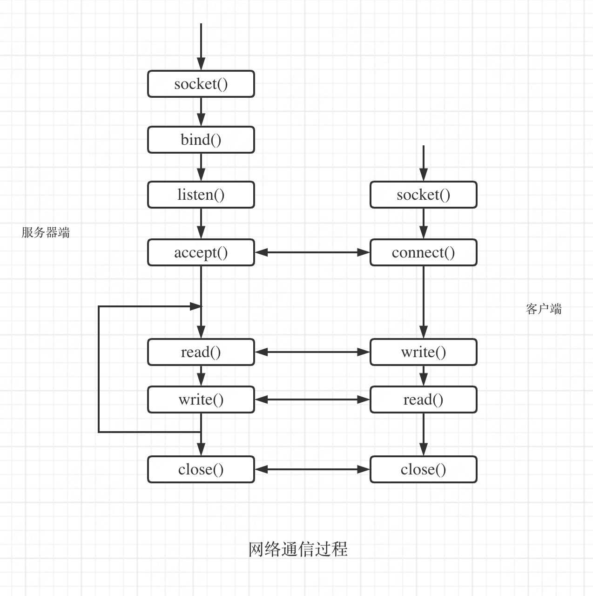
### 1.2 Java BIO 基本介绍
Java BIO 就是传统的java io 编程，其相关的类和接口在 java.io   
BIO(blocking I/O) ： 同步阻塞，服务器实现模式为一个连接一个线程，即客户端有连接请求时服务器端就需要启动一个线程进行处理，如果这个连接不做任何事情会造成不必要的线程开销，可以通过线程池机制改善(实现多个客户连接服务器)。 【后有应用实例】  
BIO方式适用于连接数目比较小且固定的架构，这种方式对服务器资源要求比较高，并发局限于应用中，JDK1.4以前的唯一选择，程序简单易理解  
BIOServer：
```java
public class BIOServer {
    public static void main(String[] args) throws Exception {

        //线程池机制
        //思路
        //1. 创建一个线程池
        //2. 如果有客户端连接，就创建一个线程，与之通讯(单独写一个方法)
        ExecutorService newCachedThreadPool = Executors.newCachedThreadPool();
        //创建ServerSocket
        ServerSocket serverSocket = new ServerSocket(6666);
        System.out.println("服务器启动了");
        while (true) {
            System.out.println("线程信息 id =" + Thread.currentThread().getId() + " 名字=" + Thread.currentThread().getName());
            //监听，等待客户端连接
            System.out.println("等待连接....");
            final Socket socket = serverSocket.accept();
            System.out.println("连接到一个客户端");

            //就创建一个线程，与之通讯(单独写一个方法)
            newCachedThreadPool.execute(new Runnable() {
                public void run() { //我们重写
                    //可以和客户端通讯
                    handler(socket);
                }
            });
        }
    }

    //编写一个handler方法，和客户端通讯
    public static void handler(Socket socket) {

        try {
            System.out.println("线程信息 id =" + Thread.currentThread().getId() + " 名字=" + Thread.currentThread().getName());
            byte[] bytes = new byte[1024];
            //通过socket 获取输入流
            InputStream inputStream = socket.getInputStream();

            //循环的读取客户端发送的数据
            while (true) {
                System.out.println("线程信息 id =" + Thread.currentThread().getId() + " 名字=" + Thread.currentThread().getName());
                System.out.println("read....");
               int read =  inputStream.read(bytes);
               if(read != -1) {
                   System.out.println(new String(bytes, 0, read
                   )); //输出客户端发送的数据
               } else {
                   break;
               }
            }
        }catch (Exception e) {
            e.printStackTrace();
        }finally {
            System.out.println("关闭和client的连接");
            try {
                socket.close();
            }catch (Exception e) {
                e.printStackTrace();
            }

        }
    }
}

```
Java BIO 问题分析  
每个请求都需要创建独立的线程，与对应的客户端进行数据 Read，业务处理，数据 Write 。  
当并发数较大时，需要创建大量线程来处理连接，系统资源占用较大。  
连接建立后，如果当前线程暂时没有数据可读，则线程就阻塞在 Read 操作上，造成线程资源浪费  
### 1.3 Java NIO 基本介绍
Java NIO 全称 java non-blocking IO，是指 JDK 提供的新 API。从 JDK1.4 开始，Java 提供了一系列改进的输入/输出的新特性，被统称为 NIO(即 New IO)，是同步非阻塞的  
NIO 相关类都被放在 java.nio 包及子包下，并且对原 java.io 包中的很多类进行改写。【基本案例】  
NIO 有三大核心部分：Channel(通道)，Buffer(缓冲区), Selector(选择器)     
NIO是 面向缓冲区 ，或者面向 块 编程的。数据读取到一个它稍后处理的缓冲区，需要时可在缓冲区中前后移动，这就增加了处理过程中的灵活性，使用它可以提供非阻塞式的高伸缩性网络  
Java NIO的非阻塞模式，使一个线程从某通道发送请求或者读取数据，但是它仅能得到目前可用的数据，如果目前没有数据可用时，就什么都不会获取，而不是保持线程阻塞，所以直至数据变的可以读取之前，该线程可以继续做其他的事情。 非阻塞写也是如此，一个线程请求写入一些数据到某通道，但不需要等待它完全写入，这个线程同时可以去做别的事情。【后面有案例说明】  
通俗理解：NIO是可以做到用一个线程来处理多个操作的。假设有10000个请求过来,根据实际情况，可以分配50或者100个线程来处理。不像之前的阻塞IO那样，非得分配10000个。   
HTTP2.0使用了多路复用的技术，做到同一个连接并发处理多个请求，而且并发请求的数量比HTTP1.1大了好几个数量级。  
NIOServer：  
```java
public class NIOServer {
    public static void main(String[] args) throws Exception{

        //创建ServerSocketChannel -> ServerSocket
        ServerSocketChannel serverSocketChannel = ServerSocketChannel.open();

        //得到一个Selecor对象
        Selector selector = Selector.open();

        //绑定一个端口6666, 在服务器端监听
        serverSocketChannel.socket().bind(new InetSocketAddress(6666));
        //设置为非阻塞
        serverSocketChannel.configureBlocking(false);

        //把 serverSocketChannel 注册到  selector 关心 事件为 OP_ACCEPT
        serverSocketChannel.register(selector, SelectionKey.OP_ACCEPT);
        System.out.println("注册后的selectionkey 数量=" + selector.keys().size()); // 1
        
        //循环等待客户端连接
        while (true) {

            //这里我们等待1秒，如果没有事件发生, 返回
            if(selector.select(1000) == 0) { //没有事件发生
                System.out.println("服务器等待了1秒，无连接");
                continue;
            }

            //如果返回的>0, 就获取到相关的 selectionKey集合
            //1.如果返回的>0， 表示已经获取到关注的事件
            //2. selector.selectedKeys() 返回关注事件的集合
            //   通过 selectionKeys 反向获取通道
            Set<SelectionKey> selectionKeys = selector.selectedKeys();
            System.out.println("selectionKeys 数量 = " + selectionKeys.size());

            //遍历 Set<SelectionKey>, 使用迭代器遍历
            Iterator<SelectionKey> keyIterator = selectionKeys.iterator();

            while (keyIterator.hasNext()) {
                //获取到SelectionKey
                SelectionKey key = keyIterator.next();
                //根据key 对应的通道发生的事件做相应处理
                if(key.isAcceptable()) { //如果是 OP_ACCEPT, 有新的客户端连接
                    //该该客户端生成一个 SocketChannel
                    SocketChannel socketChannel = serverSocketChannel.accept();
                    System.out.println("客户端连接成功 生成了一个 socketChannel " + socketChannel.hashCode());
                    //将  SocketChannel 设置为非阻塞
                    socketChannel.configureBlocking(false);
                    //将socketChannel 注册到selector, 关注事件为 OP_READ， 同时给socketChannel
                    //关联一个Buffer
                    socketChannel.register(selector, SelectionKey.OP_READ, ByteBuffer.allocate(1024));

                    System.out.println("客户端连接后 ，注册的selectionkey 数量=" + selector.keys().size()); //2,3,4..
                }
                if(key.isReadable()) {  //发生 OP_READ

                    //通过key 反向获取到对应channel
                    SocketChannel channel = (SocketChannel)key.channel();

                    //获取到该channel关联的buffer
                    ByteBuffer buffer = (ByteBuffer)key.attachment();
                    channel.read(buffer);
                    System.out.println("form 客户端 " + new String(buffer.array()));
                }

                //手动从集合中移动当前的selectionKey, 防止重复操作
                keyIterator.remove();
            }
        }
    }
}
```
NIOClient： 
```java
public class NIOClient {
    public static void main(String[] args) throws Exception{

        //得到一个网络通道
        SocketChannel socketChannel = SocketChannel.open();
        //设置非阻塞
        socketChannel.configureBlocking(false);
        //提供服务器端的ip 和 端口
        InetSocketAddress inetSocketAddress = new InetSocketAddress("127.0.0.1", 6666);
        //连接服务器
        if (!socketChannel.connect(inetSocketAddress)) {

            while (!socketChannel.finishConnect()) {
                System.out.println("因为连接需要时间，客户端不会阻塞，可以做其它工作..");
            }
        }

        //...如果连接成功，就发送数据
        String str = "hello, world";
        //Wraps a byte array into a buffer
        ByteBuffer buffer = ByteBuffer.wrap(str.getBytes());
        //发送数据，将 buffer 数据写入 channel
        socketChannel.write(buffer);
        System.in.read();

    }
}
``` 
NIO 和 BIO 的比较  
BIO 以流的方式处理数据,而 NIO 以块的方式处理数据,块 I/O 的效率比流 I/O 高很多  
BIO 是阻塞的，NIO 则是非阻塞的  
BIO基于字节流和字符流进行操作，而 NIO 基于 Channel(通道)和 Buffer(缓冲区)进行操作，数据总是从通道读取到缓冲区中，或者从缓冲区写入到通道中。Selector(选择器)用于监听多个通道的事件（比如：连接请求，数据到达等），因此使用单个线程就可以监听多个客户端通道  
### 1.4 NIO底层源码分析
Selector(选择器)  
Java 的 NIO，用非阻塞的 IO 方式。可以用一个线程，处理多个的客户端连接，就会使用到Selector(选择器)  
Selector 能够检测多个注册的通道上是否有事件发生(注意:多个Channel以事件的方式可以注册到同一个Selector)，如果有事件发生，便获取事件然后针对每个事件进行相应的处理。这样就可以只用一个单线程去管理多个通道，也就是管理多个连接和请求。    
只有在 连接/通道 真正有读写事件发生时，才会进行读写，就大大地减少了系统开销，并且不必为每个连接都创建一个线程，不用去维护多个线程避免了多线程之间的上下文切换导致的开销  
NIO源码分析: SelectorProvider  
```java
//得到一个Selecor对象
//Selector selector = Selector.open();

//SelectorProvider.provider().openSelector();

//class java.nio.channels.spi.SelectorProvider
class SelectorProvider {
    public static SelectorProvider provider() {
        synchronized (lock) {
            if (provider != null)
                return provider;
            return AccessController.doPrivileged(
                new PrivilegedAction<SelectorProvider>() {
                    public SelectorProvider run() {
                            if (loadProviderFromProperty())
                                return provider;
                            if (loadProviderAsService())
                                return provider;
                            provider = sun.nio.ch.DefaultSelectorProvider.create();
                            return provider;
                        }
                    });
        }
    }
}
```
jdk8源码solaris和macosx环境下对应的DefaultSelectorProvider如下代码块所示：  
DefaultSelectorProvider  
solaris:  
```java
public class DefaultSelectorProvider {

    /**
     * Prevent instantiation.
     */
    private DefaultSelectorProvider() { }

    @SuppressWarnings("unchecked")
    private static SelectorProvider createProvider(String cn) {
        Class<SelectorProvider> c;
        try {
            c = (Class<SelectorProvider>)Class.forName(cn);
        } catch (ClassNotFoundException x) {
            throw new AssertionError(x);
        }
        try {
            return c.newInstance();
        } catch (IllegalAccessException | InstantiationException x) {
            throw new AssertionError(x);
        }

    }

    /**
     * Returns the default SelectorProvider.
     */
    public static SelectorProvider create() {
        String osname = AccessController
            .doPrivileged(new GetPropertyAction("os.name"));
        if (osname.equals("SunOS"))
            return createProvider("sun.nio.ch.DevPollSelectorProvider");
        if (osname.equals("Linux"))
            return createProvider("sun.nio.ch.EPollSelectorProvider");
        return new sun.nio.ch.PollSelectorProvider();
    }

}
```
macos:  
```java
public class DefaultSelectorProvider {

    /**
     * Prevent instantiation.
     */
    private DefaultSelectorProvider() { }

    /**
     * Returns the default SelectorProvider.
     */
    public static SelectorProvider create() {
        return new sun.nio.ch.KQueueSelectorProvider();
    }

}
```
DefaultSelectorProvider创建了不同的SelectorImpl的实现，EPollSelectorImpl和KQueueSelectorImpl类图关系如下所示：  
 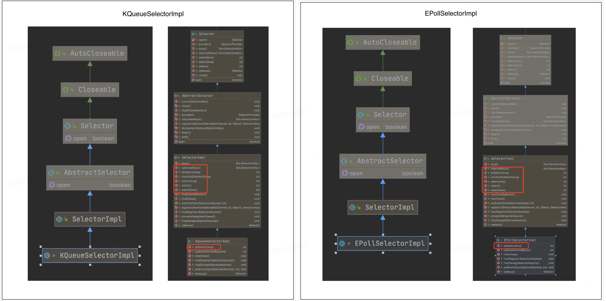
 EPollSelectorImpl 类中 doSelect 方法调用 pollWrapper.poll(timeout) 其中EPollArrayWrapper.java类中会调用以下几个native方法  
 EPollArrayWrapper
 ```java
jdk/src/solaris/classes/sun/nio/ch/EPollArrayWrapper.java
EPollArrayWrapper   
private native int epollCreate();
private native void epollCtl(int epfd, int opcode, int fd, int events);
private native int epollWait(long pollAddress, int numfds, long timeout,
                             int epfd) throws IOException;
```
EPollArrayWrapper.java类native方法对应底层c文件为：jdk/src/solaris/native/sun/nio/ch/EPollArrayWrapper.c   
 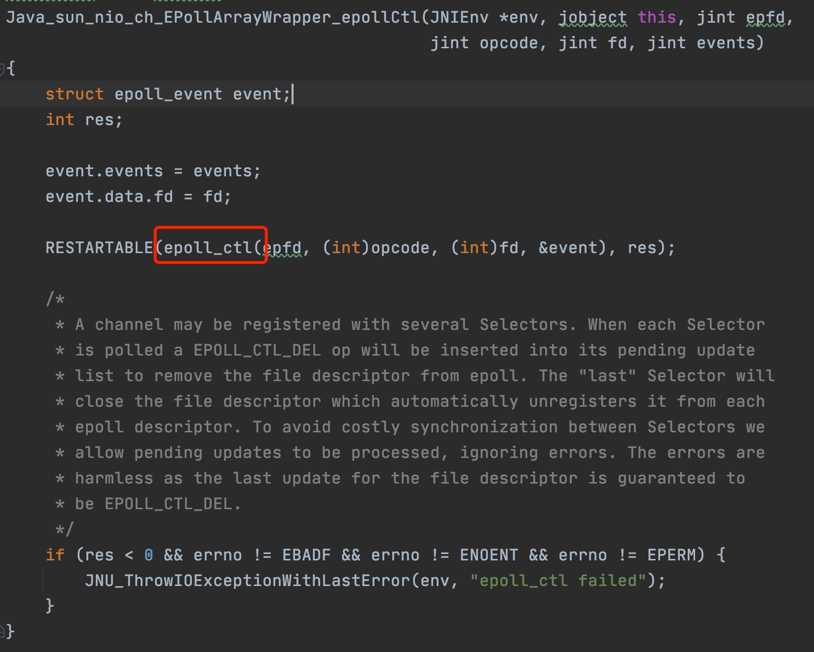
 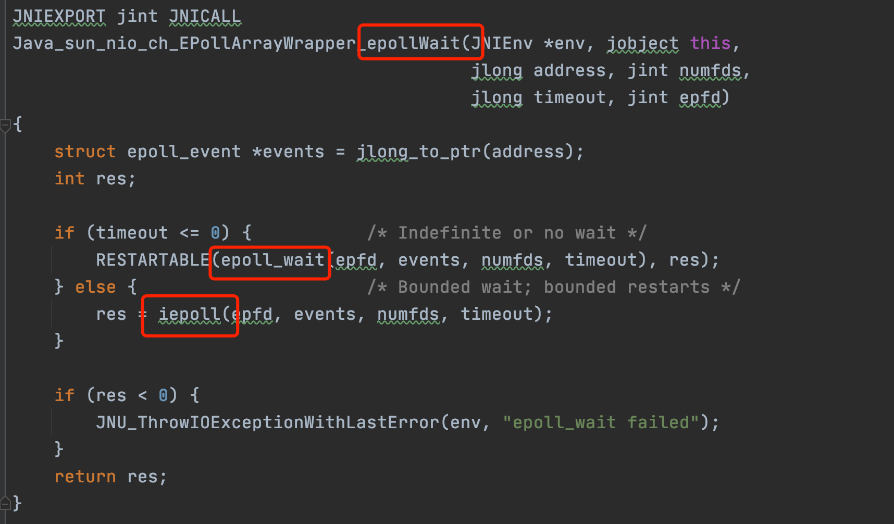
 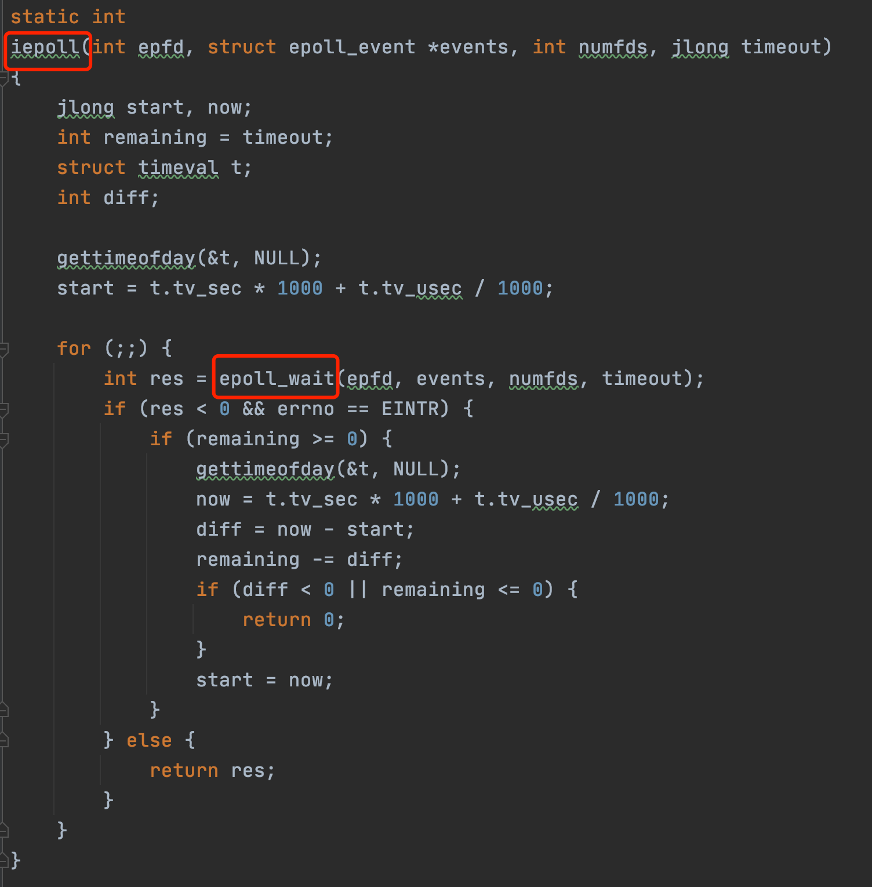
## 2 IO多路复用
### 2.1 什么是IO多路复用
IO 多路复用是一种同步IO模型，实现一个线程可以监视多个文件句柄；  
一旦某个文件句柄就绪，就能够通知应用程序进行相应的读写操作；  
没有文件句柄就绪就会阻塞应用程序，交出CPU。  
多路是指网络连接，复用指的是同一个线程  
同步阻塞（BIO）  
服务端采用单线程，当 accept 一个请求后，在 recv 或 send 调用阻塞时，将无法 accept 其他请求（必须等上一个请求处理 recv 或 send 完 ）（无法处理并发）  
同步阻塞（BIO）-- 单线程  
```c++
// 伪代码描述
while (true) {
	// accept阻塞
    client_fd = accept(listen_fd);
    fds.append(client_fd);
    for (fd in fds) {
    	// recv阻塞（会影响上面的accept）
        if (recv(fd)) {
        	// logic
        }
    }
}
```
服务端采用多线程，当 accept 一个请求后，开启线程进行 recv，可以完成并发处理，但随着请求数增加需要增加系统线程，大量的线程占用很大的内存空间，并且线程切换会带来很大的开销，10000个线程真正发生读写实际的线程数不会超过20%，每次accept都开一个线程也是一种资源浪费。  
同步阻塞（BIO）-- 多线程  
```c++
// 伪代码描述
while(true) {
  // accept阻塞
  client_fd = accept(listen_fd)
  // 开启线程read数据（fd增多导致线程数增多）
  new Thread func() {
    // recv阻塞（多线程不影响上面的accept）
    if (recv(fd)) {
      // logic
    }
  }  
}
```
IO多路复用  
服务器端采用单线程通过select/poll/epoll等系统调用获取 fd 列表，遍历有事件的 fd 进行accept/recv/send，使其能支持更多的并发连接请求。  
```c++
// 伪代码描述
while(true) {
  // 通过内核获取有读写事件发生的fd，只要有一个则返回，无则阻塞
  // 整个过程只在调用select、poll、epoll这些调用的时候才会阻塞，accept/recv是不会阻塞
  for (fd in select(fds)) {
    if (fd == listen_fd) {
        client_fd = accept(listen_fd)
        fds.append(client_fd)
    } elseif (len = recv(fd) && len != -1) { 
      // logic
    }
  }  
}
```
### 2.2 select
```c++
#include <stdio.h>
#include <sys/types.h>
#include <sys/socket.h>
#include <netinet/in.h>
#include <sys/wait.h>
#include <signal.h>
#include <errno.h>
#include <sys/select.h>
#include <sys/time.h>
#include <unistd.h>
#include <stdlib.h>
#include <string.h>
#include <arpa/inet.h>
#include <sys/fcntl.h>
#include <poll.h>

#define MAXBUF 256
#define MAXNFDS 1024

void child_process(void)
{
    sleep(2);
    char msg[MAXBUF];
    struct sockaddr_in addr = {0};
    int n, sockfd, num = 1;
    srandom(getpid());
    /* Create socket and connect to server */
    sockfd = socket(AF_INET, SOCK_STREAM, 0);
    addr.sin_family = AF_INET;
    addr.sin_port = htons(2000);
    addr.sin_addr.s_addr = inet_addr("127.0.0.1");

    connect(sockfd, (struct sockaddr *)&addr, sizeof(addr));

    printf("child {%d} connected \n", getpid());
    while (1)
    {
        int sl = (random() % 10) + 1;
        num++;
        sleep(sl);
        sprintf(msg, "Test message %d from client %d", num, getpid());
        n = write(sockfd, msg, strlen(msg)); /* Send message */
    }
}

int main()
{
    char buffer[MAXBUF];
    int fds[5];
    struct sockaddr_in addr;
    struct sockaddr_in client;
    int addrlen, n, i, max = 0;
    int sockfd, commfd;
    //fd_set 
    fd_set rset;
    for (i = 0; i < 5; i++)
    {
        if (fork() == 0)
        {
            child_process();
            exit(0);
        }
    }

    sockfd = socket(AF_INET, SOCK_STREAM, 0);
    memset(&addr, 0, sizeof(addr));
    addr.sin_family = AF_INET;
    addr.sin_port = htons(2000);
    addr.sin_addr.s_addr = INADDR_ANY;
    bind(sockfd, (struct sockaddr *)&addr, sizeof(addr));
    listen(sockfd, 5);

    //模拟5个客户端连接
    for (i=0;i<5;i++)
    {
      memset(&client, 0, sizeof (client));
      //addrlen = sizeof(client);
      socklen_t len = sizeof(client);
      fds[i] = accept(sockfd,(struct sockaddr*)&client, &len);
      if(fds[i] > max)  //找到最大的文件描述符
        max = fds[i];
    }

    while(1){
      //rset 是一个bitmap 开始使用之前所有位清零
      FD_ZERO(&rset);
      for (i = 0; i< 5; i++ ) {
        FD_SET(fds[i],&rset);
      }

      puts("round again");
      select(max+1, &rset, NULL, NULL, NULL);  //select是一个系统调用，会阻塞直到有数据发送到socket，select会把rset相应的位置置位，并不会返回具体哪个socket有数据

      //用户态遍历rset 看哪一位被置位了，从被置位的文件描述符读取数据
      for(i=0;i<5;i++) {
        if (FD_ISSET(fds[i], &rset)){
          memset(buffer,0,MAXBUF);
          int isize = read(fds[i], buffer, MAXBUF);
          puts(buffer);
          //printf("recv(eventfd=%d,size=%d):%s\n",fds[i],isize,buffer);
          printf("recv(eventfd=%d):%s\n",fds[i],buffer);
        }
      }
    }
    return 0;
}
```
它仅仅知道了，有I/O事件发生了，却并不知道是哪那几个流（可能有一个，多个，甚至全部），我们只能无差别轮询所有流，找出能读出数据，或者写入数据的流，对他们进行操作。  
所以select具有O(n)的无差别轮询复杂度，同时处理的流越多，无差别轮询时间就越长。   
select本质上是通过设置或者检查存放fd标志位的数据结构来进行下一步处理。这样所带来的缺点是：  
1. 单个进程所打开的FD是有限制的，通过 FD_SETSIZE设置，默认1024 ;  
2. 每次调用 select，都需要把 fd 集合从用户态拷贝到内核态，这个开销在 fd 很多时会很大；  
需要维护一个用来存放大量fd的数据结构，这样会使得用户空间和内核空间在传递该结构时复制开销大  
3. 对 socket 扫描时是线性扫描，采用轮询的方法，效率较低（高并发）  
当套接字比较多的时候，每次select()都要通过遍历FD_SETSIZE个Socket来完成调度,不管哪个Socket是活跃的,都遍历一遍。这会浪费很多CPU时间。如果能给套接字注册某个回调函数，当他们活跃时，自动完成相关操作，那就避免了轮询，这正是epoll与kqueue做的。  
### 2.3 poll
代码示例  
```c++
#include <stdio.h>
#include <sys/types.h>
#include <sys/socket.h>
#include <netinet/in.h>
#include <sys/wait.h>
#include <signal.h>
#include <errno.h>
#include <sys/select.h>
#include <sys/time.h>
#include <unistd.h>
#include <stdlib.h>
#include <string.h>
#include <arpa/inet.h>
#include <sys/fcntl.h>
#include <poll.h>
//#include <sys/epoll.h>

#define MAXBUF 256
#define MAXNFDS 1024

void child_process(void)
{
    sleep(2);
    char msg[MAXBUF];
    struct sockaddr_in addr = {0};
    int n, sockfd, num = 1;
    srandom(getpid());
    /* Create socket and connect to server */
    sockfd = socket(AF_INET, SOCK_STREAM, 0);
    addr.sin_family = AF_INET;
    addr.sin_port = htons(2000);
    addr.sin_addr.s_addr = inet_addr("127.0.0.1");

    connect(sockfd, (struct sockaddr *)&addr, sizeof(addr));

    printf("child {%d} connected \n", getpid());
    while (1)
    {
        int sl = (random() % 10) + 1;
        num++;
        sleep(sl);
        sprintf(msg, "Test message %d from client %d", num, getpid());
        n = write(sockfd, msg, strlen(msg)); /* Send message */
    }
}

int main()
{
    char buffer[MAXBUF];
    int fds[5];
    struct sockaddr_in addr;
    struct sockaddr_in client;
    int addrlen, n, i, max = 0;
    int sockfd, commfd;
    fd_set rset;
    for (i = 0; i < 5; i++)
    {
        if (fork() == 0)
        {
            child_process();
            exit(0);
        }
    }

    sockfd = socket(AF_INET, SOCK_STREAM, 0);
    memset(&addr, 0, sizeof(addr));
    addr.sin_family = AF_INET;
    addr.sin_port = htons(2000);
    addr.sin_addr.s_addr = INADDR_ANY;
    bind(sockfd, (struct sockaddr *)&addr, sizeof(addr));
    listen(sockfd, 5);
  
    //poll - test
      struct pollfd pollfds[MAXNFDS];// fds存放需要监视的socket。
      for (i=0;i<5;i++)
      {
        memset(&client, 0, sizeof (client));
        socklen_t len = sizeof(client);
        pollfds[i].fd = accept(sockfd,(struct sockaddr*)&client, &len);
        pollfds[i].events = POLLIN;   //关注读事件
      }
     
      while(1){
      puts("round again");
    	poll(pollfds, 5, 50000);  //poll 交给内核判断是否有事件发生，有的话将revents置位1

    	for(i=0;i<5;i++) {
    		if (pollfds[i].revents & POLLIN){  //遍历数组 找到有事件的fd
    			pollfds[i].revents = 0; //找到后 revents 置0 
    			memset(buffer,0,MAXBUF);
    			read(pollfds[i].fd, buffer, MAXBUF);
    			puts(buffer);
    		}
    	}
      }
    return 0;
}
```
```c++
// 数据结构
struct pollfd {
    int fd;                         // 需要监视的文件描述符
    short events;                   // 需要内核监视的事件 读事件 或 写事件
    short revents;                  // 实际发生的事件
};
```
poll优缺点分析  
poll本质上和select没有区别，它将用户传入的数组拷贝到内核空间，然后查询每个fd对应的设备状态， 但是它没有最大连接数的限制，原因是它是基于链表来存储的.  
它没有最大连接数的限制，原因是它是基于链表来存储的，但是同样有缺点：  
1. 每次调用 poll ，都需要把 fd 集合从用户态拷贝到内核态，这个开销在 fd 很多时会很大；  
2. 对 socket 扫描是线性扫描，采用轮询的方法，效率较低（高并发时）  
### 2.4 epoll
代码示例  
```c++
#include <stdio.h>
#include <sys/types.h>
#include <sys/socket.h>
#include <netinet/in.h>
#include <sys/wait.h>
#include <signal.h>
#include <errno.h>
#include <sys/select.h>
#include <sys/time.h>
#include <unistd.h>
#include <stdlib.h>
#include <string.h>
#include <arpa/inet.h>
#include <sys/fcntl.h>
#include <poll.h>
//#include <sys/epoll.h>

#define MAXBUF 256
#define MAXNFDS 1024

void child_process(void)
{
    sleep(2);
    char msg[MAXBUF];
    struct sockaddr_in addr = {0};
    int n, sockfd, num = 1;
    srandom(getpid());
    /* Create socket and connect to server */
    sockfd = socket(AF_INET, SOCK_STREAM, 0);
    addr.sin_family = AF_INET;
    addr.sin_port = htons(2000);
    addr.sin_addr.s_addr = inet_addr("127.0.0.1");

    connect(sockfd, (struct sockaddr *)&addr, sizeof(addr));

    printf("child {%d} connected \n", getpid());
    while (1)
    {
        int sl = (random() % 10) + 1;
        num++;
        sleep(sl);
        sprintf(msg, "Test message %d from client %d", num, getpid());
        n = write(sockfd, msg, strlen(msg)); /* Send message */
    }
}

int main()
{
    char buffer[MAXBUF];
    int fds[5];
    struct sockaddr_in addr;
    struct sockaddr_in client;
    int addrlen, n, i, max = 0;
    int sockfd, commfd;
    fd_set rset;
    for (i = 0; i < 5; i++)
    {
        if (fork() == 0)
        {
            child_process();
            exit(0);
        }
    }

    sockfd = socket(AF_INET, SOCK_STREAM, 0);
    memset(&addr, 0, sizeof(addr));
    addr.sin_family = AF_INET;
    addr.sin_port = htons(2000);
    addr.sin_addr.s_addr = INADDR_ANY;
    bind(sockfd, (struct sockaddr *)&addr, sizeof(addr));
    listen(sockfd, 5);

    //epoll -test
    struct epoll_event events[5];
    int epfd = epoll_create(10);  //epoll_create在内核开辟一块内存空间 用来存放fd
    for (i = 0; i < 5; i++)
    {
        printf("accept start i = %d \n",i);
        static struct epoll_event ev;
        memset(&client, 0, sizeof(client));
        //addrlen = sizeof(client);
        socklen_t len = sizeof(client);
        ev.data.fd = accept(sockfd, (struct sockaddr *)&client, &len);
        printf("accept fd =%d \n",ev.data.fd);
        ev.events = EPOLLIN;
        epoll_ctl(epfd, EPOLL_CTL_ADD, ev.data.fd, &ev); //把每一个socket连接的fd添加到epfd 即epoll_create开辟的内存空间上
    }
   
    while (1)
    {
        puts("round again");
        int nfds = epoll_wait(epfd, events, 5, 10000); //epoll_wait 阻塞只有当epfd中有事件发生的fd会放入events就绪链表中，返回nfds为就绪fd的个数

        printf("epoll_wait nfds =%d \n",nfds);
        //遍历就绪链表 读取数据
        for (i = 0; i < nfds; i++)
        {
            memset(buffer, 0, MAXBUF);
            read(events[i].data.fd, buffer, MAXBUF);
            puts(buffer);
        }
    }

    return 0;
}
```
epoll源码实现中 eventpoll数据结构  
```c++
// 数据结构
// 每一个epoll对象都有一个独立的eventpoll结构体
// 用于存放通过epoll_ctl方法向epoll对象中添加进来的事件
// epoll_wait检查是否有事件发生时，只需要检查eventpoll对象中的rdlist双链表中是否有epitem元素即可
struct eventpoll {
    /*红黑树的根节点，这颗树中存储着所有添加到epoll中的需要监控的事件*/
    struct rb_root  rbr;
    /*双链表中则存放着将要通过epoll_wait返回给用户的满足条件的事件*/
    struct list_head rdlist;
};
```
epoll的优点  
1. 没有最大并发连接的限制，能打开的FD的上限远大于1024（1G的内存上能监听约10万个端口）；  
2. 效率提升，不是轮询的方式，不会随着FD数目的增加效率下降。只有活跃可用的FD才会调用callback函数；即Epoll最大的优点就在于它只管你“活跃”的连接，而跟连接总数无关，因此在实际的网络环境中，Epoll的效率就会远远高于select和poll；  
3. epoll是每个fd的事件单独拷贝的，epoll_ctl把需要监听的fd拷贝到内核空间，epoll_wait把需要读写的fd拷贝到用户空间，不用像select/poll那样每次拷贝所有的fds  

epoll缺点  
1. epoll只能工作在 linux 下 
 
epoll LT 与 ET 模式的区别  
epoll 有 EPOLLLT 和 EPOLLET 两种触发模式，LT 是默认的模式，ET 是 “高速” 模式。  
1. LT 模式下，只要这个 fd 还有数据可读，每次 epoll_wait 都会返回它的事件，提醒用户程序去操作；  
2. ET 模式下，它只会提示一次，直到下次再有数据流入之前都不会再提示了，无论 fd 中是否还有数据可读。所以在 ET 模式下，read 一个 fd 的时候一定要把它的 buffer 读完，或者遇到 EAGIN 错误。  
epoll使用“事件”的就绪通知方式，通过epoll_ctl注册fd，一旦该fd就绪，内核就会采用类似callback的回调机制来激活该fd，epoll_wait便可以收到通知。  
epoll如何实现IO多路复用  
 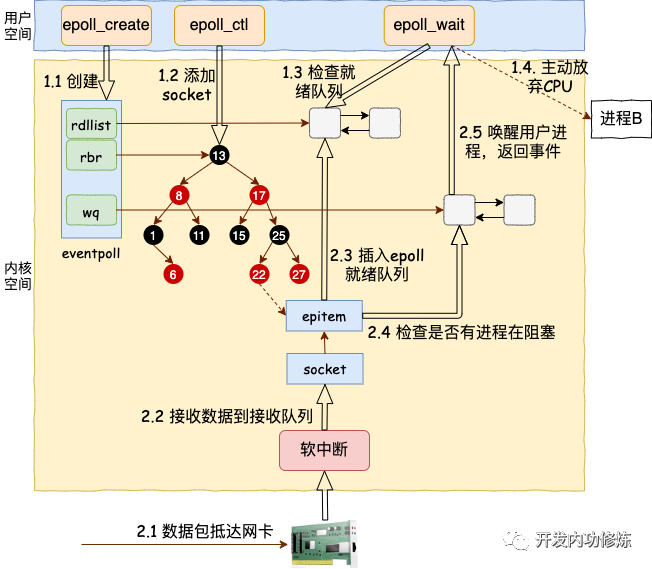
 
附源码分析：  
https://www.bbsmax.com/A/Ae5RK8B7dQ/  
https://mp.weixin.qq.com/s/OmRdUgO1guMX76EdZn11UQ  
 
## 3 Java NIO应用
### 3.1 Netty
NettyServer 代码示例：   
```java
import io.netty.bootstrap.ServerBootstrap;
import io.netty.channel.*;
import io.netty.channel.nio.NioEventLoopGroup;
import io.netty.channel.socket.SocketChannel;
import io.netty.channel.socket.nio.NioServerSocketChannel;
import io.netty.channel.socket.nio.NioSocketChannel;

public class NettyServer {
    public static void main(String[] args) throws Exception {
        //创建BossGroup 和 WorkerGroup
        //1. 创建两个线程组 bossGroup 和 workerGroup
        //2. bossGroup 只是处理连接请求 , 真正的和客户端业务处理，会交给 workerGroup完成
        //3. 两个都是无限循环
        //4. bossGroup 和 workerGroup 含有的子线程(NioEventLoop)的个数  默认实际 cpu核数 * 2
        EventLoopGroup bossGroup = new NioEventLoopGroup(1);
        EventLoopGroup workerGroup = new NioEventLoopGroup(); //8
        try {
            ServerBootstrap bootstrap = new ServerBootstrap();  //创建服务器端的启动对象，配置参数
            bootstrap.group(bossGroup, workerGroup)  //使用链式编程来进行设置 //设置两个线程组
                    .channel(NioServerSocketChannel.class) //使用NioSocketChannel 作为服务器的通道实现
                    .option(ChannelOption.SO_BACKLOG, 128) // 设置线程队列得到连接个数
                    .childOption(ChannelOption.SO_KEEPALIVE, true) //设置保持活动连接状态
//                    .handler(null) // 该 handler对应 bossGroup , childHandler 对应 workerGroup
                    .childHandler(new ChannelInitializer<SocketChannel>() {//创建一个通道初始化对象(匿名对象)
                        //给pipeline 设置处理器
                        @Override
                        protected void initChannel(SocketChannel ch) throws Exception {
        //可以使用一个集合管理 SocketChannel，再推送消息时，可以将业务加入到各个channel对应的NIOEventLoop的taskQueue或者 scheduleTaskQueue
                            ch.pipeline().addLast(new NettyServerHandler());
                        }
                    }); // 给我们的workerGroup 的 EventLoop 对应的管道设置处理器
            //绑定一个端口并且同步, 生成了一个 ChannelFuture 对象  启动服务器(并绑定端口)
            ChannelFuture cf = bootstrap.bind(6668).sync();
            cf.addListener(new ChannelFutureListener() {  //给cf 注册监听器，监控我们关心的事件
                @Override
                public void operationComplete(ChannelFuture future) throws Exception {
                    if (cf.isSuccess()) {
                    } else {
                    }
                }
            });
            //对关闭通道进行监听
            cf.channel().closeFuture().sync();
        }finally {
            bossGroup.shutdownGracefully();
            workerGroup.shutdownGracefully();
        }
    }
}
```
工作原理示意图:  

（1）Netty抽象出两组线程池 BossGroup 专门负责接收客户端的连接, WorkerGroup 专门负责网络的读写  
（2）BossGroup 和 WorkerGroup 类型都是 NioEventLoopGroup  
（3）NioEventLoopGroup 相当于一个事件循环组, 这个组中含有多个事件循环 ，每一个事件循环是 NioEventLoop  
（4）NioEventLoop 表示一个不断循环的执行处理任务的线程， 每个NioEventLoop 都有一个selector , 用于监听绑定在其上的socket的网络通讯  
（5）NioEventLoopGroup 可以有多个线程, 即可以含有多个NioEventLoop  
（6）每个Boss NioEventLoop 循环执行的步骤有3步  
1. 轮询accept 事件  
2. 处理accept 事件 , 与client建立连接 , 生成NioScocketChannel , 并将其注册到某个worker NIOEventLoop 上的 selector   
3. 处理任务队列的任务 ， 即 runAllTasks
  
（7） 每个 Worker NIOEventLoop 循环执行的步骤  
1. 轮询read, write 事件  
2. 处理i/o事件， 即read , write 事件，在对应NioScocketChannel 处理  
3. 处理任务队列的任务 ， 即 runAllTasks  
（8）每个Worker NIOEventLoop 处理业务时，会使用pipeline(管道), pipeline 中包含了 channel , 即通过pipeline 可以获取到对应通道, 管道中维护了很多的 处理器  
源码分析：  
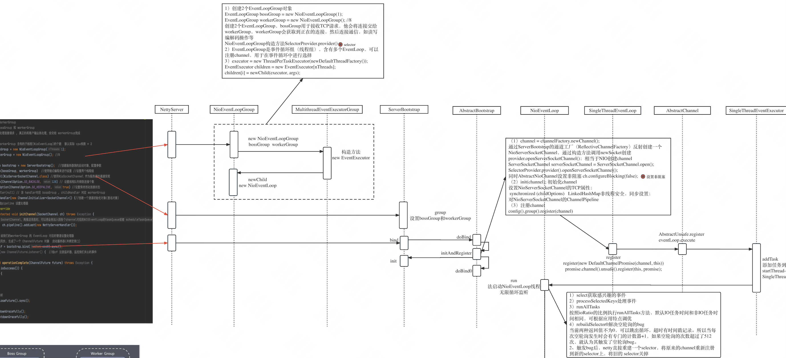
### 3.2 Redis
1 单线程事件循环  
我们首先来剖析一下 Redis 的核心网络模型，从 Redis 的 v1.0 到 v6.0 版本之前，Redis 的核心网络模型一直是一个典型的单 Reactor 模型：利用 epoll/select/kqueue 等多路复用技术，在单线程的事件循环中不断去处理事件（客户端请求），最后回写响应数据到客户端：  
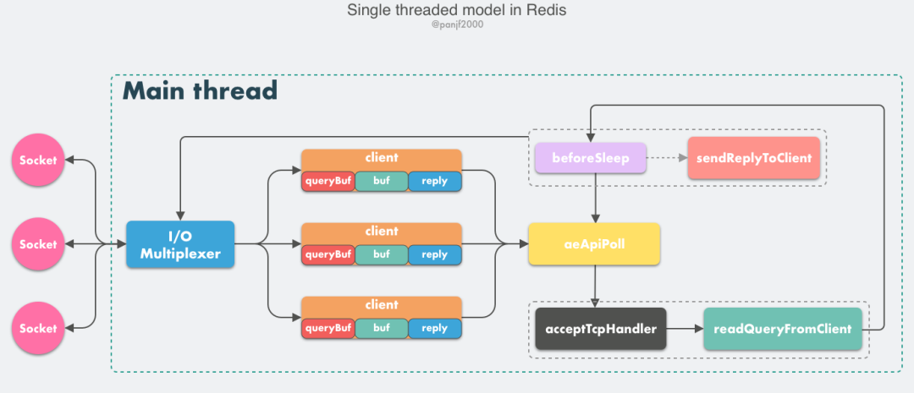
这里有几个核心的概念需要学习：  
* client：客户端对象，Redis 是典型的 CS 架构（Client <---> Server），客户端通过 socket 与服务端建立网络通道然后发送请求命令，服务端执行请求的命令并回复。Redis 使用结构体 client 存储客户端的所有相关信息，包括但不限于封装的套接字连接 -- *conn，当前选择的数据库指针 -- *db，读入缓冲区 -- querybuf，写出缓冲区 -- buf，写出数据链表 -- reply等。  
* aeApiPoll：I/O 多路复用 API，是基于 epoll_wait/select/kevent 等系统调用的封装，监听等待读写事件触发，然后处理，它是事件循环（Event Loop）中的核心函数，是事件驱动得以运行的基础。  
* acceptTcpHandler：连接应答处理器，底层使用系统调用 accept 接受来自客户端的新连接，并为新连接注册绑定命令读取处理器，以备后续处理新的客户端 TCP 连接；除了这个处理器，还有对应的 acceptUnixHandler 负责处理 Unix Domain Socket 以及 acceptTLSHandler 负责处理 TLS 加密连接。  
* readQueryFromClient：命令读取处理器，解析并执行客户端的请求命令。  
* beforeSleep：事件循环中进入 aeApiPoll 等待事件到来之前会执行的函数，其中包含一些日常的任务，比如把 client->buf 或者 client->reply （后面会解释为什么这里需要两个缓冲区）中的响应写回到客户端，持久化 AOF 缓冲区的数据到磁盘等，相对应的还有一个 afterSleep 函数，在 aeApiPoll 之后执行。  
* sendReplyToClient：命令回复处理器，当一次事件循环之后写出缓冲区中还有数据残留，则这个处理器会被注册绑定到相应的连接上，等连接触发写就绪事件时，它会将写出缓冲区剩余的数据回写到客户端。  

Redis 内部实现了一个高性能的事件库 --- AE，基于 epoll/select/kqueue/evport 四种事件驱动技术，实现 Linux/MacOS/FreeBSD/Solaris 多平台的高性能事件循环模型。Redis 的核心网络模型正式构筑在 AE 之上，包括 I/O 多路复用、各类处理器的注册绑定，都是基于此才得以运行。  
至此，我们可以描绘出客户端向 Redis 发起请求命令的工作原理：  
1. Redis 服务器启动，开启主线程事件循环（Event Loop），注册 acceptTcpHandler 连接应答处理器到用户配置的监听端口对应的文件描述符，等待新连接到来；  
2. 客户端和服务端建立网络连接；  
3. acceptTcpHandler 被调用，主线程使用 AE 的 API 将 readQueryFromClient 命令读取处理器绑定到新连接对应的文件描述符上，并初始化一个 client 绑定这个客户端连接；  
4. 客户端发送请求命令，触发读就绪事件，主线程调用 readQueryFromClient 通过 socket 读取客户端发送过来的命令存入 client->querybuf 读入缓冲区；  
5. 接着调用 processInputBuffer，在其中使用 processInlineBuffer 或者 processMultibulkBuffer 根据 Redis 协议解析命令，最后调用 processCommand 执行命令；  
6. 根据请求命令的类型（SET, GET, DEL, EXEC 等），分配相应的命令执行器去执行，最后调用 addReply 函数族的一系列函数将响应数据写入到对应 client 的写出缓冲区：client->buf 或者 client->reply ，client->buf 是首选的写出缓冲区，固定大小 16KB，一般来说可以缓冲足够多的响应数据，但是如果客户端在时间窗口内需要响应的数据非常大，那么则会自动切换到 client->reply 链表上去，使用链表理论上能够保存无限大的数据（受限于机器的物理内存），最后把 client 添加进一个 LIFO 队列 clients_pending_write；  
7. 在事件循环（Event Loop）中，主线程执行 beforeSleep --> handleClientsWithPendingWrites，遍历 clients_pending_write 队列，调用 writeToClient 把 client 的写出缓冲区里的数据回写到客户端，如果写出缓冲区还有数据遗留，则注册 sendReplyToClient 命令回复处理器到该连接的写就绪事件，等待客户端可写时在事件循环中再继续回写残余的响应数据。  
对于那些想利用多核优势提升性能的用户来说，Redis 官方给出的解决方案也非常简单粗暴：在同一个机器上多跑几个 Redis 实例。事实上，为了保证高可用，线上业务一般不太可能会是单机模式，更加常见的是利用 Redis 分布式集群多节点和数据分片负载均衡来提升性能和保证高可用。  

2 Redis 多线程网络模型  
6.0 版本之后，Redis 正式在核心网络模型中引入了多线程，也就是所谓的 I/O threading，至此 Redis 真正拥有了多线程模型。前一小节，我们了解了 Redis 在 6.0 版本之前的单线程事件循环模型，实际上就是一个非常经典的 Reactor 模型：  
Redis 虽然也实现了多线程，但是却不是标准的 Multi-Reactors/Master-Workers 模式，这其中的缘由我们后面会分析，现在我们先看一下 Redis 多线程网络模型的总体设计：  
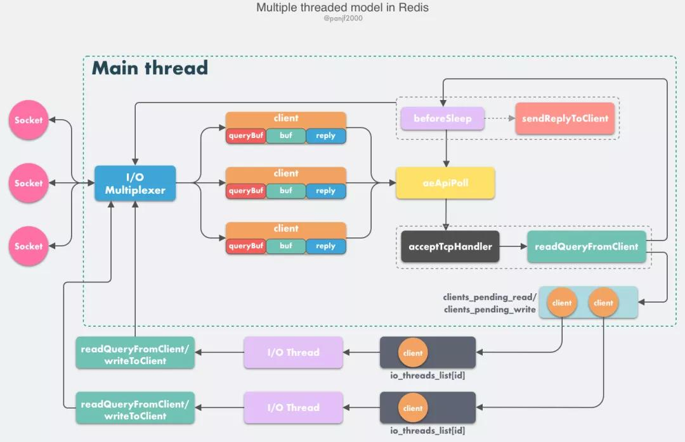
多线程模型大部分逻辑和之前的单线程模型是一致的，变动的地方仅仅是把读取客户端请求命令和回写响应数据的逻辑异步化了，交给 I/O 线程去完成，这里需要特别注意的一点是：I/O 线程仅仅是读取和解析客户端命令而不会真正去执行命令，客户端命令的执行最终还是要在主线程上完成。  

工作原理  
1. Redis 服务器启动，开启主线程事件循环（Event Loop），注册 acceptTcpHandler 连接应答处理器到用户配置的监听端口对应的文件描述符，等待新连接到来；
2. 客户端和服务端建立网络连接；
3. acceptTcpHandler 被调用，主线程使用 AE 的 API 将 readQueryFromClient 命令读取处理器绑定到新连接对应的文件描述符上，并初始化一个 client 绑定这个客户端连接；
4. 客户端发送请求命令，触发读就绪事件，服务端主线程不会通过 socket 去读取客户端的请求命令，而是先将 client 放入一个 LIFO 队列 clients_pending_read；
5. 在事件循环（Event Loop）中，主线程执行 beforeSleep -->handleClientsWithPendingReadsUsingThreads，利用 Round-Robin 轮询负载均衡策略，把 clients_pending_read队列中的连接均匀地分配给 I/O 线程各自的本地 FIFO 任务队列 io_threads_list[id] 和主线程自己，I/O 线程通过 socket 读取客户端的请求命令，存入 client->querybuf 并解析第一个命令，但不执行命令，主线程忙轮询，等待所有 I/O 线程完成读取任务；
6. 主线程和所有 I/O 线程都完成了读取任务，主线程结束忙轮询，遍历 clients_pending_read 队列，执行所有客户端连接的请求命令，先调用 processCommandAndResetClient 执行第一条已经解析好的命令，然后调用 processInputBuffer 解析并执行客户端连接的所有命令，在其中使用 processInlineBuffer 或者 processMultibulkBuffer 根据 Redis 协议解析命令，最后调用 processCommand 执行命令；
7. 根据请求命令的类型（SET, GET, DEL, EXEC 等），分配相应的命令执行器去执行，最后调用 addReply 函数族的一系列函数将响应数据写入到对应 client 的写出缓冲区：client->buf 或者 client->reply ，client->buf 是首选的写出缓冲区，固定大小 16KB，一般来说可以缓冲足够多的响应数据，但是如果客户端在时间窗口内需要响应的数据非常大，那么则会自动切换到 client->reply 链表上去，使用链表理论上能够保存无限大的数据（受限于机器的物理内存），最后把 client 添加进一个 LIFO 队列 clients_pending_write；
8. 在事件循环（Event Loop）中，主线程执行 beforeSleep --> handleClientsWithPendingWritesUsingThreads，利用 Round-Robin 轮询负载均衡策略，把 clients_pending_write 队列中的连接均匀地分配给 I/O 线程各自的本地 FIFO 任务队列 io_threads_list[id] 和主线程自己，I/O 线程通过调用 writeToClient 把 client 的写出缓冲区里的数据回写到客户端，主线程忙轮询，等待所有 I/O 线程完成写出任务；
9. 主线程和所有 I/O 线程都完成了写出任务， 主线程结束忙轮询，遍历 clients_pending_write 队列，如果 client 的写出缓冲区还有数据遗留，则注册 sendReplyToClient 到该连接的写就绪事件，等待客户端可写时在事件循环中再继续回写残余的响应数据。

3 源码分析  
其中整个 Redis 服务的代码总入口在 src/server.c 文件中，我把入口函数的核心部分摘了出来，如下：  
```c++
//file: src/server.c
int main(int argc, char **argv) {
    ......
    // 启动初始化
    initServer();
    // 运行事件处理循环，一直到服务器关闭为止
    aeMain(server.el);
}
```
其实整个 Redis 的工作过程，就只需要理解清楚 main 函数中调用的 initServer 和 aeMain 这两个函数就足够了。  
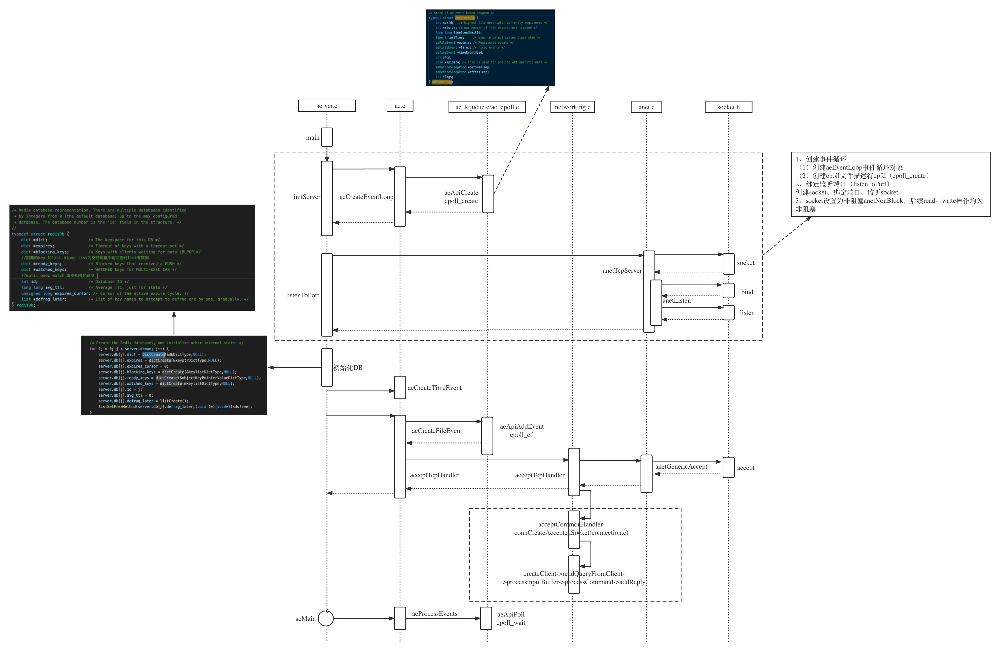
在 initServer 这个函数内，Redis 做了这么三件重要的事情。  
* 创建一个 epoll 对象
* 对配置的监听端口进行 listen
* 把 listen socket 让 epoll 给管理起来
initServer:  
```c++
//file: src/server.c
void initServer() {
    // 2.1.1 创建 epoll
    server.el = aeCreateEventLoop(server.maxclients+CONFIG_FDSET_INCR);

    // 2.1.2 绑定监听服务端口
    listenToPort(server.port,server.ipfd,&server.ipfd_count);

    // 2.1.3 注册 accept 事件处理器
    for (j = 0; j < server.ipfd_count; j++) {
        aeCreateFileEvent(server.el, server.ipfd[j], AE_READABLE,
            acceptTcpHandler,NULL);
    }
    ...
}
```
在 aeMain 函数中，是一个无休止的循环。在每一次的循环中，要做如下几件事情。  
* 通过 epoll_wait 发现 listen socket 以及其它连接上的可读、可写事件
* 若发现 listen socket 上有新连接到达，则接收新连接，并追加到 epoll 中进行管理
* 若发现其它 socket 上有命令请求到达，则读取和处理命令，把命令结果写到缓存中，加入写任务队列
* 每一次进入 epoll_wait 前都调用 beforesleep 来将写任务队列中的数据实际进行发送
* 如若有首次未发送完毕的，当写事件发生时继续发送
```c++
void aeMain(aeEventLoop *eventLoop) {
    eventLoop->stop = 0;
    while (!eventLoop->stop) {
        aeProcessEvents(eventLoop, AE_ALL_EVENTS|
                                   AE_CALL_BEFORE_SLEEP|
                                   AE_CALL_AFTER_SLEEP);
    }
}

//file:src/ae.c
void aeMain(aeEventLoop *eventLoop) {

    eventLoop->stop = 0;
    while (!eventLoop->stop) {

        // 如果有需要在事件处理前执行的函数，那么运行它
        // 3.4 beforesleep 处理写任务队列并实际发送之
        if (eventLoop->beforesleep != NULL)
            eventLoop->beforesleep(eventLoop);

        // 开始等待事件并处理
        // 3.1 epoll_wait 发现事件
        // 3.2 处理新连接请求
        // 3.3 处理客户连接上的可读事件
        aeProcessEvents(eventLoop, AE_ALL_EVENTS);
    }
}

//file:src/ae.c
int aeProcessEvents(aeEventLoop *eventLoop, int flags)
{
    // 获取最近的时间事件
    tvp = xxx

    // 处理文件事件，阻塞时间由 tvp 决定
    numevents = aeApiPoll(eventLoop, tvp);
    for (j = 0; j < numevents; j++) {
        // 从已就绪数组中获取事件
        aeFileEvent *fe = &eventLoop->events[eventLoop->fired[j].fd];

        //如果是读事件，并且有读回调函数
        fe->rfileProc()

        //如果是写事件，并且有写回调函数
        fe->wfileProc()
    }
}

//file: src/ae_epoll.c
static int aeApiPoll(aeEventLoop *eventLoop, struct timeval *tvp) {
    // 等待事件
    aeApiState *state = eventLoop->apidata;
    epoll_wait(state->epfd,state->events,eventLoop->setsize,
            tvp ? (tvp->tv_sec*1000 + tvp->tv_usec/1000) : -1);
    ...
}
```
参考资料：  
https://segmentfault.com/a/1190000039223696  
http://static.kancloud.cn/smrbot/dx3906/2668165  
https://heapdump.cn/article/3798624?fromComment=true  
### 3.3 Kafka
Kafka消息发送及消费原理示意图：
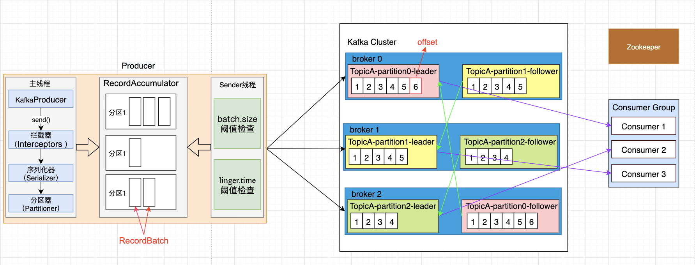
1. Producer端   
生产者代码示例：https://github.com/apache/kafka/blob/trunk/examples/src/main/java/kafka/examples/Producer.java  
源码分析示意图如下：  
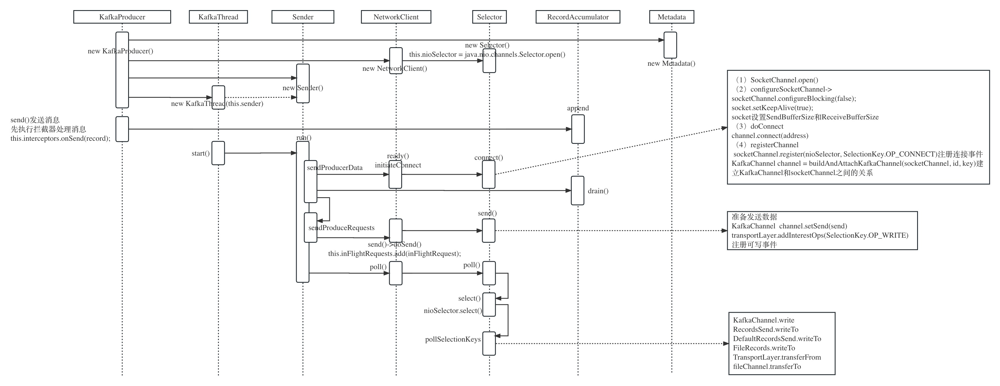
2. Broker端网络架构设计  
 
broker服务器端网络架构设计如下图所示： 
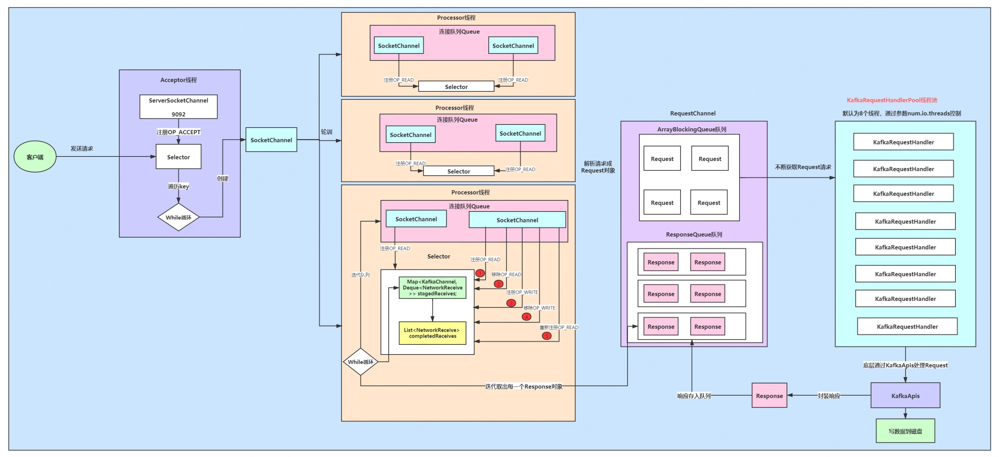
1. 首先客户端发送请求全部会先发送给一个Acceptor，broker里面会存在3个线程（默认是3个），这3个线程都是叫做processor，Acceptor不会对客户端的请求做任何的处理，直接封装成一个个socketChannel发送给这些processor形成一个队列，发送的方式是轮询，就是先给第一个processor发送，然后再给第二个，第三个，然后又回到第一个。消费者线程去消费这些socketChannel时，会获取一个个request请求，这些request请求中就会伴随着数据。
2. 线程池里面默认有8个线程，这些线程是用来处理request的，解析请求，如果request是写请求，就写到磁盘里。读的话返回结果。processor会从response中读取响应数据，然后再返回给客户端。这就是Kafka的网络三层架构。
3. 如果我们需要对kafka进行增强调优，可以增加processor并增加线程池里面的处理线程，达到性能调优的效果。request和response那一块部分其实就是起到了一个缓存的效果，是考虑到processor生成请求太快，线程数不够不能及时处理的问题。所以这就是一个加强版的reactor网络线程模型。
### 3.4 Zookeeper
### 3.5 Nginx
