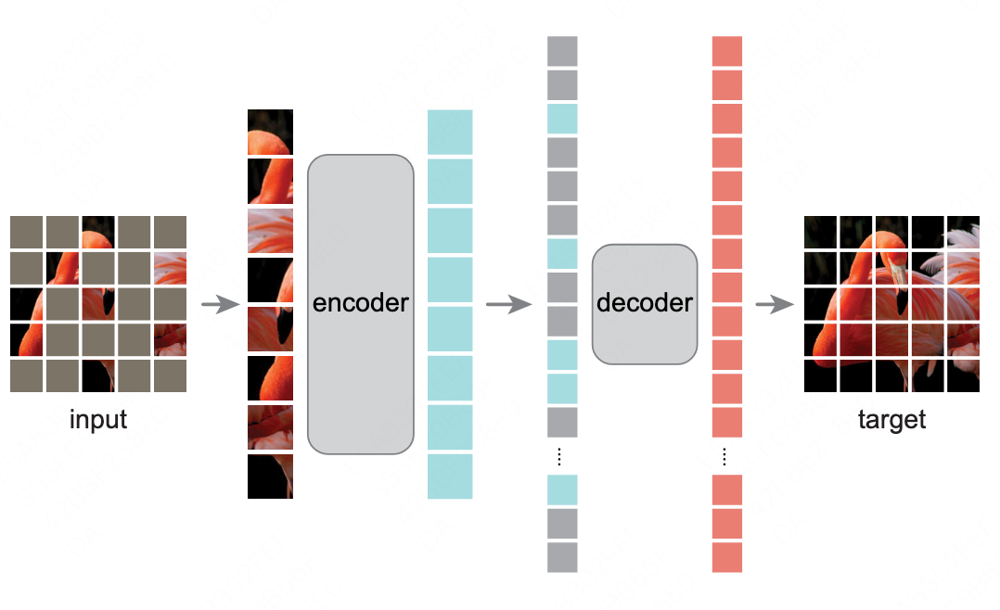
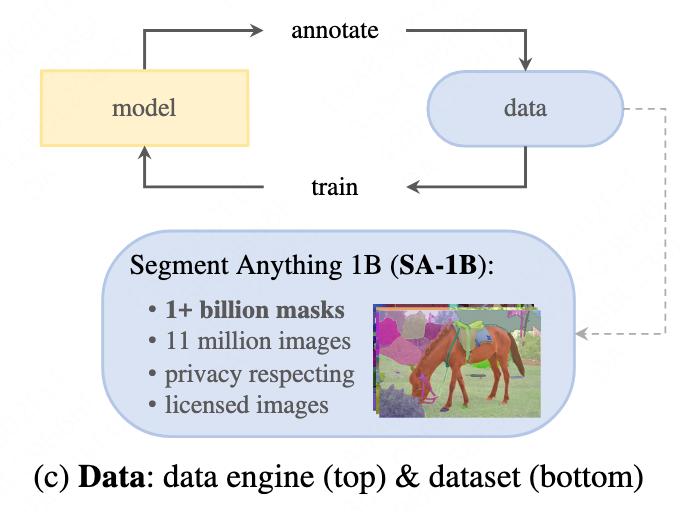

# Segment Anything
## 1 基本信息
| 论文名 | Segment Anything |
| :--- | :---: | 
| 时间 | 2023-04-16 | 
| 作者 | Alexander Kirillov / Eric Mintun / Nikhila Ravi / Hanzi Mao 等 |
| 机构 | The FAIR team of Meta AI |
| 代码 | https://github.com/facebookresearch/segment-anything |
| 论文地址| https://research.facebook.com/publications/segment-anything |
| Demo| https://segment-anything.com |
| SA-1B数据集| https://ai.facebook.com/datasets/segment-anything/ |
## 2 背景
Meta 在23年4月发布了图像分割领域的基础模型 Segment Anything Model (SAM)，如标题所述，这篇论文只做了一件事情：（零样本）分割一切，类似于 GPT-4 已经做到的「回答一切」。  
这篇论文将 NLP 的 prompt 范式引入了 CV 领域，关注模型的通用性和泛化性，为 CV领域的基础模型研究打开了一扇门，NLP基础模型的发展（左）和相关子任务泛化方式（右）如下图所示：   
其中比较典型的是GPT的进化路径：  

| 模型 | 模型思路 | 预训练数据量 | 参数量 | 方法说明 | 
| :--- | :---: | :---: | :---: | :---: |
| GPT | Pre-Training + Fine-Tuning  | 约5GB | 1.17 亿 | 1）预训练一个大模型    2）对每个下游子任务，统一样本输入格式 Seq<开始符、文本、分割符、文本、抽取符>，然后做有监督性的模型微调，类似CV领域的模型微调|
| GPT2 | Pre-Training + Zero-Shot | 40GB | 15 亿 | 1）预训练一个大模型   2）不提供任何子任务的训练样本，直接使用预训练模型对子任务做预测，统一输入格式为自然语言Prompt |
| GPT3 | Pre-Training + Few/One-Shot | 45TB | 1,750 亿 | 1）预训练一个大模型   2）提供少量样本，模拟人类通过少量样本学习的能力，但模型不做任何的梯度更新。 |
| SAM | Pre-Training + Zero-Shot | 1100万 images 10亿 masks |  | 1）预训练一个大模型   2）不提供任何样本，直接使用预训练模型对子任务做预测，统一输入格式为几类prompt，包括前景/背景点、粗略框或掩模、自由文本 |
SAM的出现统一了CV领域图像分割子任务的全部下游应用，这说明了CV方向的大模型是可能存在的，未来更多CV子领域可能都会被统一处理，可以说SAM正式开启了CV的大模型时代，特别是在数据标注方面有重大意义。  
## 3 方案
总得来说，Meta 通过 新数据集+新范式+超强零样本泛化能力 完成了图像分割的基础模型，整体设计思路包含以下3个部分：  
1. 能增强泛化性的预训练任务
2. 适配的模型结构
3. 更大的分割数据集    

**Part1：预训练任务（提示分割任务）**  
Meta的目标是设计图像分割的基础模型，该模型需要对任何形式的『指示信息』生成合理的mask，为了实现上述零样本迁移能力，Meta 借鉴了 NLP 的 prompt 范式，设计了一种提示学习任务用于模型预训练，它和多目标任务的区别是：  

| 任务| 主要差异 |
| :--- | :---: |
| 多目标任务 | 单个模型执行一组固定的任务，例如语义分割、实例分割和边缘检测等，但训练和测试任务相同 |
| 提示学习任务 | 提示+组合实现零样本泛化，模型可以作为一个组件直接用到新任务中，例如 SAM+目标检测=实例分割   例如，如果存在一个猫边界框检测器，猫实例分割任务 = 边界框检测器（得到box类型的prompt） + SAM |

Meta 为图像分割设计了涵盖广泛图像元素的prompt，用于提示图像中需要进行分割的物体，主要包括前景/背景点、粗略框或掩模、自由文本。  
这里存在的一个问题是如果提示不明确或者能同时指代多个对象（例如，在衬衫上的一个点既可能表示衬衫也可能表示穿着它的人），怎么为不明确的提示生成合理有效的mask？  
Meta的处理办法是：当面临歧义的分割对象时，SAM同时输出多个有效掩码，如右图。  

**Part2：模型结构**
此前图像分割作为计算机视觉的核心任务已经得到广泛应用，但是我们通常需要为特定任务创建准确的分割模型，需要技术专家进行高度专业化的工作，更需要大量的领域标注数据，这些因素都限制了图像分割的进一步发展。  
令我们惊喜的是，SAM（Segment Anything Model）作为一种单一模型，可以在新的图像分割应用中即开即用，无需额外的训练，能自动或根据提示分割图像中的所有内容，SAM整体框架如图所示：  

整个模型主要包含3个组件：图像编码器、提示编码器、轻量级mask解码器。
1. 图像编码器  
SAM的图像编码器采用了MAE（左）自监督训练的ViT（右）模型，可以提取图片的embedding特征。  
MAE 在训练时用高比例掩码对图像进行遮挡，并用解码器进行图像重建；在测试时，解码器被丢弃，用编码器提取无损图像的特征完成下游任务。  
  

2. 提示编码器 
提示编码器对输入的各种prompt进行编码，主要分为稀疏prompt和稠密prompt两种：  
    (1)稠密prompt当中，mask使用CNN来提取embedding特征  
    (2)稀疏prompt当中，points, box 使用位置编码器来提取embedding特征；text直接用CLIP中的文本编码器来提取embedding特征 
3. 轻量级mask解码器  
轻量级mask解码器是基于transformer decoder block的改版，主要是在prompt-to-image和image-to-promp计算 self-attention and cross-attention，后面再接一个MLP计算所有点为前景的概率得到mask，其中可学习的output token 表示prompt类别：  

【功能】上述模型设计存在以下优点：  
* 灵活方便：SAM 允许用户通过单击、交互式点击或边界框提示来分割对象，提示可以是前景\背景点、粗框或掩码、自由格式文本
* 适配模糊提示：对每一个prompt预测三个mask，选择与loss最小的mask做反向传播（这是多输出模型的常用方法），同时模型会对每一个mask预测一个置信度分数。
* 实时性：在预计算图像嵌入后，SAM 可以为任何提示生成实时分割掩码，允许与模型进行实时交互。  
图像编码器为图像生成一次性嵌入，轻量级提示编码器将提示实时转换为嵌入向量，然后这两个信息源被组合送入预测mask的轻量级解码器中。

【训练】SAM采用了交互式分割的方法进行预训练，对每一个mask随机采样11轮prompt：   
* 1轮：等概率随机选择point或box作为提示  
point：从真实mask中均匀采样点；  
box：选择真实mask边界框，在每个坐标中加入随机噪声，标准差为box边长的10%，最大20像素  
* 8轮：在第一个prompt预测后，从前一个预测mask和真实mask之间的误差区域中均匀地采样后续点作为point提示，并用前一次预测的mask作为额外的提示输入
* 2轮：仅用前一次预测的mask作为提示输入，鼓励模型从预测mask中学习。  
这两轮迭代，一个随机插入到8个迭代采样点之间，另一个放在最后

Loss 和 其他训练设置：  
迭代次数】：90k iterations (∼2 SA-1B epochs)   
【GPU和训练时长】：256 A100 GPUS for 68 hours  
【LR】：warmup并初始化为8e−4  
【LOSS】：（Focal Loss + Dice Loss） for mask头；MSE for IoU 头   

更多细节可参考 Per-Pixel Classification is Not All You Need for Semantic Segmentation（https://export.arxiv.org/pdf/2107.06278.pdf）

**Part3：数据引擎**
在整个3部分中，最重要的可能是数据引擎这个部分，正所谓兵马未动粮草先行，这里猜测一下SAM模型本身可能只是为了收集数据而开发的副产物。
SA-1B是一个专为训练通用物体分割模型而设计的数据集，它是有史以来最大的分割数据集，包含了1100万张多样化、高清晰度、隐私保护的照片（明确为相机拍摄），以及11亿个精细的分割mask，这些照片由一家大型图片公司提供并授权，在数据许可证（Apache 2.0）允许的前提下，可用于计算机视觉研究。
这些mask是由Meta开发的数据引擎（Data Engine）自动生成的，展示了该引擎强大的自动化标注能力。其中每张图像的平均分辨率为1500×2250像素，每张图像包含约100个mask。  

SA-1B的收集过程简单来说就是 注释员使用 SAM 交互式地注释图像，然后新注释的数据反过来用于更新 SAM，彼此相互作用，重复执行此循环来改善模型和数据集，具体分为三阶段：  

1. 模型辅助的手工注释阶段：收集一些高质量的mask数据，用于训练和改进SAM模型  
先用开源数据集训练SAM，将其作为交互式数据标注工具。SAM模型会根据标注人员的输入（点击、框选或输入文本）实时更新Mask，并提供一些候选Mask供标注人员选择或修改。这样标注人员可以快速地对图像中的对象进行精确的修改，而不需要手动绘制每个mask（每个mask只需要14s，比COCO的注释速度快6.5倍）。随着标注的数据越来越多，逐步使用新标注的数据重新训练SAM，并扩大SAM的Image encoder（从ViT-B到ViT-H），这个阶段在 12W 图像共收集了4.3M mask  

